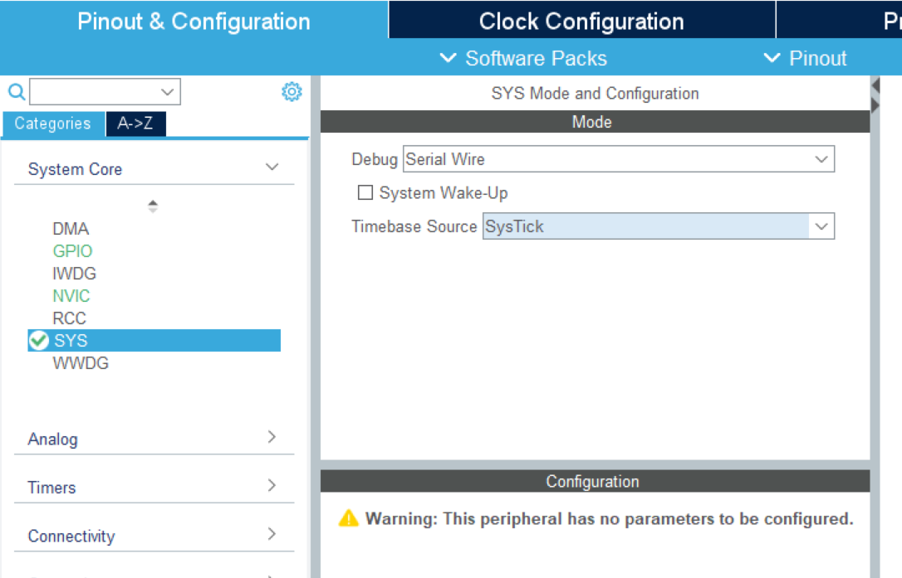
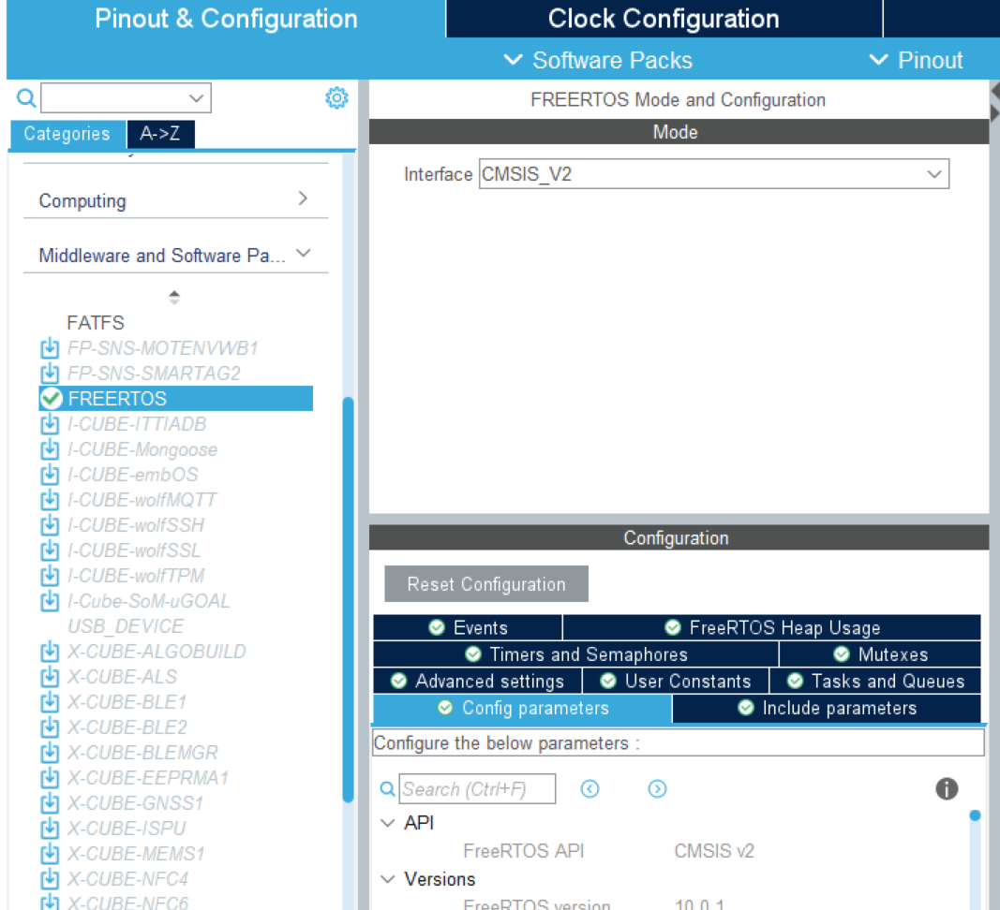
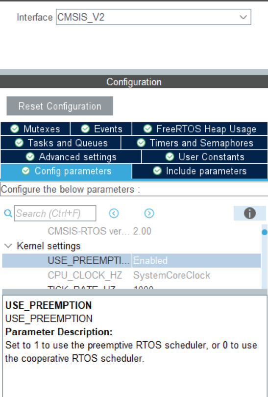

# freeRTOS（寒培）

## 简介

- 全程：Free Real Time[^1] Operation System 

- 用处：

1.让单片机（单核）跑多线程。

创建了task之后freeRTOS让CPU在多个任务之间迅速切换执行

2.任务线程交互

如将串口发来的消息解析然后执行

## 操作系统的简要原理

大致流程：

- 让每个task都有一个虚拟处理器来处理

- 要进行下一个任务的时候将上一个虚拟处理器中的数据复制到内存里，然后吧下一个任务虚拟处理器的数据复制到实际处理器中

- 有算法的调度器进行这两个复制工作

调度方式：
1. 协作式：只有运行态任务进入阻塞态或者运行态任务显示taskYIELD（）的时候，才会进行切换。任务永远不会被抢占，具有相同优先级的任务不会自动共享处理器时间。优点是，工作方式简单，占用资源少。缺点是，响应不够快。

1. 优先级抢占式：每个任务都赋予了一个优先级。每个任务都可以存在于一个或多个状态。任何时候只有一个任务可以处于运行状态。调度器在所有处于就绪任务重选择具有最高优先级的任务执行。*-->which means，如果在运行task1，此时task2突然处于就绪状态且优先级高于task1，task1就被迫中断，处理器运行task2* （强及时性，常用）

    

    

## STM32CubeMX配置创建FreeFTOS工程

1. 打开创建一个工程SYS中的时钟源按照需求选择定时器TIMx（Systick被FreeRTOS占用不可以用作工程的时间基准）

2. 在**Middleware**里找到**FREERTOS**的**interface**选择软件接口（CMSIS_V2比V1具有更多功能，正常情况下 CMSIS_V1 够用了，普通功能选 CMSIS_V1，高级功能选 CMSIS_V2。如果懒得分就直接V2吧）

3. 抢占式和协作式的切换（默认Enable，抢占式）

    

4. 时钟配置哪里要选择72HZ（RCC要选择高速晶振）

5. 其他一样，没有特殊要求

## 注释

[^1]:realtime,实时。这是freeRTOS与其他操作系统最大的区别。实时分为软实时和硬实时。软实时要求在规定时间内完成任务的概率很高，偶尔可以超时。而硬实时要求必须严格地在规定时间内完成任务。与实时相对的是分时（windows，macOs等等使用）主要让用户感觉不出就行，要求没那么高。
