# FreeRTOS代码学习(CMSIS_V1)

___


## Chapter 1 任务管理

### 任务函数

原型：`void Function(void* Parameters)`


___


### 创建任务

原型：

````c
portBASE_TYPE xTaskCreate(pdTask_Code pvTaskCode，   		//参数1
						const signed portCHAR* const pcName //参数2
						unsigned portSHCRT usStackDepth,    //参数3
                          void* pvParameters,				//参数4
                          unsigned portBase TYPE_uxPriority,//参数5
                          xTaskHandle *pxCreatedTask);		//参数6
````


参数：

1. pdTask_Code pvTaskCode : 传入对应任务函数名

2. const signed portCHAR* const pcName：一个字符串，用于赋予任务一个名字方便调试

3. unsigned portSHCRT usStackDepth：用于指定系统向任务分配多少栈空间

4. void* pvParameters：向任务函数传递参数（就是上面任务函数中的传递的参数）

5. unsigned portBase TYPE_uxPriority：指定任务执行的优先级,范围为**0 ~ MAX_PRIORITIES-1**(但cubeMX设定中无法更改最大优先级） *0表示最低优先级*

    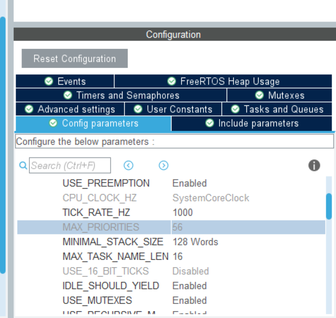

​		

6. xTaskHandle *pxCreatedTask: 用于传出任务的句柄(指向任务的指针），无传出可以设定为NULL

7. 返回值：

    返回`pdTRUE`为创建任务成功  

    `errCOULD_NOT_LOCATE_REQUIRES_MEMORY` 为内存不足无法创建任务


==注意==：

有同一个任务函数可以创建多个任务,可通过其他参数区分


___


### 任务调度器

再main（）函数调用`vTaskStartScheduler()`开始执行任务

例如：

````c
int main(void)
{
    xTaskCreate(...);
    xTaskCreate(...);
    xTaskCreate(...);
    ...;
    vTaskStartScheduler();//启动FreeRTOS
    
    for(;;) //如果任务正常执行，则不会执行改行
}
````


___


### 任务优先级

任务调度器总是再运行任务中选择最高优先级任务，如果高优先级任务总是处于可运行状态，那么低优先级任务永远不会执行（称之为低优先级任务被 饿死 :crying_cat_face:)

所以为了执行不同优先级任务，通常将高优先级任务设置为**事件驱动**，即只有当某些事情发生，高优先级任务才会进入可运行状态


___

### 事件驱动、任务状态

 如果一个任务正在等待某个事件，则称这个任务处于**阻塞态(blocked)**。阻塞态是非运行态的一个子状态。任务可以进入阻塞态以等待以下两种不同类型的事件:
1. **定时(时间相关)事件**——这类事件可以是延迟到期或是绝对时间到点。比如说某个任务可以进入阻塞态以延迟 10ms。

2. **同步事件**——源于其它任务或中断的事件。比如说，某个任务可以进入阻塞态以等待队列中有数据到来。同步事件囊括了所有板级范围内的事件类型。

任务可以在进入阻塞态以等待同步事件时指定一个等待超时时间，这样可以有效地实现阻塞状态下同时等待两种类型的事件。

**挂起(suspended)**也是非运行状态的子状态。处于挂起状态的任务对调度器而言是不可见的。让一个任务进入挂起状态的唯一办法就是调用`vTasksuspend()API`函数;而把一个挂起状态的任务唤醒的唯一途径就是调用 `vTaskResume()`或`vTaskResumeFromISR()API`(ISR，中断）函数。大多数应用程序中都不会用到挂起状态。

如果任务处于非运行状态，但既没有阻塞也没有挂起，则这个任务处于**就绪(ready，准备或就绪)状态**。处于就绪态的任务能够被运行,但只是“准备(ready)“运行，而当前尚未运行。

___

### 利用阻塞态实现延迟
`vTaskDelay()`用于实现阻塞态延迟，函数原型为:
`void vTaskDelay(portTickType xTicksToDelay)`
参数:`xTicksToDelay`用于指定延迟时间，单位为tick，可以通过常数`portTICK_RATE_MS`将毫秒单位转换为tick，具体公式如下:


==如果开了CMSIS_V2库会自动转换不需要带公式==

- 调用 `vTaskpelay()`后，会把该任务设置为阻塞态，此时其他任务可以得到执行，从而避免低优先任务被饿死

- `vTaskDelayUnti1()`与`vTaskDelay()`类似，前者从该任务进入运行态时开始计时，而后者从其本身被调用开始计时，因而前者可以保证任务具有固定执行频率。`vTaskDelayUnti1()`的第二个参数与`vTaskDelay()` 完全相同，第一个参数应初始化为任务创建时的tick，此后由函数自动更新，用于计算绝对时间。参数原型:`portTickType* pxPreviousWakeTime`

使用实例：

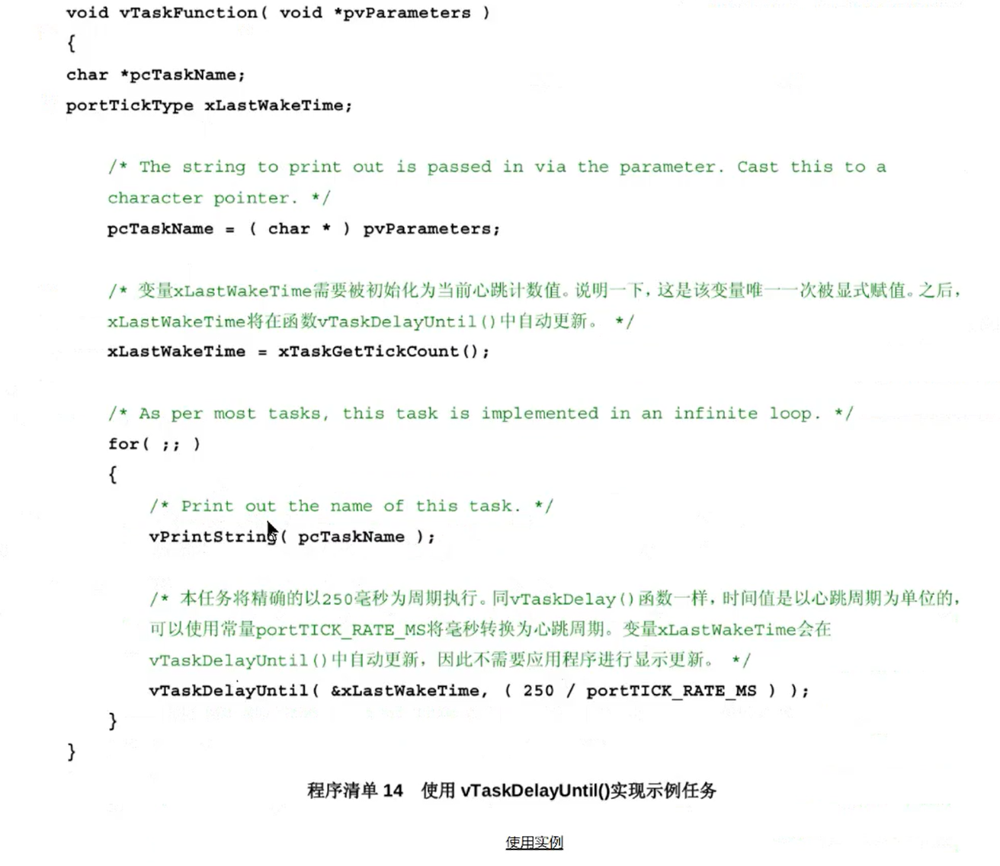

___

### 空闲任务、空闲任务回调函数
处理器总是需要代码来执行--所以**至少要有一个任务处于运行态**。为了保证这一点，为了避免所有任务都处于阻塞态而处理器无代码处理而进入错误状态，当调用`vTaskStartSchedulerO` 时，调度器会自动创建一个空闲任务。空闲任务是一个非常短小的循环--和最早的示例任务十分相似，总是可以运行。空闲任务拥有最低优先级(优先级 0)以保证其不会妨碍具有更高优先级的应用任务进入运行态一-当然，没有任何限制说是不能把应用任务创建在与空闲任务相同的优先级上;如果需要的话，你一样可以和空闲任务一起共享优先级，
通过**空闲任务钩子函数(或称回调，hook,or call-back)**，可以直接在空闲任务中添加应用程序相关的功能。空闲任务钩子函数会被空闲任务每循环一次就自动调用一次。通常空闲任务钩子函数被用于:
1. 执行低优先级，后台或需要不停处理的功能代码。
2. 测试系统处理裕量(空闲任务只会在所有其它任务都不运行时才有机会执行，所以测量出空闲任务占用的处理时间就可以清楚的知道系统有多少富余的处理时间)。
3. 将处理器配置到低功耗模式一-提供一种自动省电方法，使得在没有任何应用功能需要处理的时候，系统自动进入省电模式。
==注意:==
空闲任务钩子函数**不得阻塞或挂起**，必须尽快返回(尽量不要有Delay函数)
空闲任务钩子函数必须有以下原型，无需调用(由空闲任务函数自动调用):
`void vApplicationIdleHook(void)`

___

### 改变任务优先级
1. `void vTaskPriorityset(xTaskHandle pxTask, unsigned portBASE_TYPE uxNewPriority)`
   用于在调度器启动后改变任何任务的优先级。参数1为被修改优先级的任务句柄(由xTaskcreate()传出)，参数2为目标优先级范围为0~configMAX PRIORITIES-1.
2. `unsigned portBASE_TYPE uxTaskPriorityGet(xTaskHandle pxTask)`
   用于查询某任务的优先级。参数1为目标任务的任务句柄，返回值为优先级。

___

### 删除任务
`void vTaskDelete(xTaskHandle pxTaskToDelete)`
用于删除某任务。参数1为目标任务的任务句柄，任务可以通过传入NULL来删除自己。由于释放已删除任务内存的工作由空闲任务来执行，因此需要删除任务的系统**不能饿死空闲任务**

___

### 切换任务
`void taskYIELD(void)`
用于通知调度器立即进行任务切换。某个任务调用 `taskYIELD()`等效于其自愿放弃运行态。


___

## Chapter 2 队列管理
==FreeRTOS 中所有的通信与同步机制都是基于队列实现的==

### 队列特性
1. 队列可以保存的最大单元数目被称为队列的**深度**。在队列创建时需要设定其深度和每个单元的大小。队列为先进先出。一个队列可供**多个**不同任务写入或读出。
2. 当任务试图读入队列的数据时，该任务可以设置一个**阻塞超时时间**，在这段时间内，当队列为空时，该任务保持阻塞态直到其它任务向队列中写入了数据或超时，然后该任务变为就绪态。若有多个任务读入同一个队列时指定了阻塞超时时间，则当队列数据有效时优先级最高的任务解除阻塞，若优先级相同，则**等待最久的任务**解除阻塞。
3. 任务试图向队列写入数据时，该任务也可以设置一个**阻塞超时时间**，当队列已满时，该任务进入阻塞态直到队列有空闲或超时。多任务解除阻塞规则与2相同。

___
### 使用队列
1. `xQueueHandle xQueuecreate(unsigned portBASE_TYPE uxQueueLength, unsigned portBASE_TYPE uxItemSize)`
   用于创建队列。参数1为队列深度，参数2为一个单元的长度，单位为字节，返回值为其创建队列的句柄，若因内存不足而创建失败则返回NULL。
2. `portBASE_TYPE xQueueSendToBack(xQueueHandle xQueue, const void* pvItemToQueue, portTickType xTicksTowait)
    `xQueueSend()`
    `xQueueSendToFront()`
    以上三个函数具有完全相同的返回值和参数。函数1和2完全等同，用于向队列尾添加数据。函数3用于向队列首添加数据。参数1为目标队列的句柄，参数2为发送数据的指针，参数3为阻塞超时时间，单位为tick，设置为0表示当阻塞时立即返回，设置为portMAX DELAY 表示无限制阻塞超时时间。
    返回值可能有以下两种情况:
  1. 返回 pdPAss:表示数据成功发射到队列，包括发送时未遭阻塞和遭遇阻塞但在阻塞超时时间前解除阻塞,
  2. 返回 errQUEUE_FULL:表示由于队列已满数据发射失败，即阻塞时间超过了阻塞超时时间。
3. `portBASE_TYPE xQueueReceive( xQueueHandle xQueue, const void* pvBuffer, portTickType xTicksToWait )`
    `xQueuePeek()`
    以上两个函数具有完全相同的返回值和参数，都用于从队列首读入数据，但函数1读入后会**删除队列中的数据**，函数2不会。
    参数1为目标队列的句柄，参数2为读取数据的缓存，参数3为阻塞超时时间。
    返回值与2完全相同。
4. `unsigned portBASE_TYPE uxQueueMessagesWaiting(xQueueHandle xQueue)`
    用于查询目标队列中有效数据单元的个数。参数1为目标队列的句柄，返回值为有效数据单元个数。
    ==注意:==2，3，4中的所有函数均不应在中断中使用，应该在中断中使用这些函数对应的中断安全版本(在[这里]()介绍)
5. `uxQueueMessagesWaitingFromISR()` :是4.函数的中断安全版本。

___
### 队列传输大型数据单元
如果队列存储的数据单元尺寸较大，那最好是利用队列来传递数据的指针而不是对数据本身在队列上一字节一字节地拷贝进或拷贝出。但是，当你利用队列传递指针时，==一定要十分小心地做到以下两点==:
    1. **指针指向的内存空间的所有权必须明确**
       当任务间通过指针共享内存时，应该从根本上保证不会有任意两个任务同时修改共享内存中的数据，或是以其它行为方式使得共享内存数据无效或产生一致性问题。原则上，共享内存在其指针发送到队列之前，其内容只允许被发送任务访问;共享内存指针从队列中被读出之后，其内容亦只允许被接收任务访问。
    2. **指针指向的内存空间必须有效**
       如果指针指向的内存空间是动态分配的，只应该有一个任务负责对其进行内存释放。当这段内存空间被释放之后，就不应该有任何一个任务再访问这段空间。


____


## Chapter 3 中断管理
### 延迟中断处理
传统的中断处理在中断处理函数(中断回调函数)中完成，这种中断处理方式具有极大的缺点: 在中断处理过程中，其余的任务全部被打断(main()函数)。因此，对于处理量较大的函数，必须进行**延迟中断**处理，将中断处理**延迟**到中断之后的**处理任务**中进行，此时便可以对此处理任务**设置优先级**，以避免对中断的处理打断其它更重要的任务。若此中断本身优先级较高，则可以设置处理任务为最高优先级，此时该中断**相当于在中断回调函数中处理**。
设置了中断处理任务的中断，其中断处理函数应**尽快退出**。

___
### 二值信号量 二进制信号量
二值信号量的本质是一个**深度为1的队列**8，只有**空**和**满**两种状态，由此得名。
二值信号量可以在某个特殊的中断发生时，让任务解除阻塞，相当于让任务与中断**同步**。中断处理任务**获取**信号量，当信号量未发出时进入阻塞态。当中断发生时，中断回调函数**给出**信号量，使中断处理任务解除阻塞态，从而使中断得到延迟处理。[^1]

1. `void vSemaphoreCreateBinary(xSemaphoreHandle xSemaphore)`
    用于创建一个二值信号量。参数1为其创建的信号量的句柄。使用时应初始化一个`xSemaphoreHandle`的变量，然后**按值**传入该函数。
    
2. `portBASE_TYPE xSemaphoreTake(xSemaphoreHandle xSemaphore, portTickType xTicksToWait)`
   用于获取信号量，等同于一次P()操作。参数1为目标信号量的句柄，参数2为阻塞超时时间，单位为tick，若设置为0则信号量无效时立即返回，设置为 portMAX DELAY表示无限制阻塞超时时间。
   返回值可能有两种情况:
   1. 返回 `pdPASS`:表示成功获得信号量，包括进入阻塞但在阻塞超时时间前成功获取信号量。
   2. 返回 `pdFALSE`:表示进入阻塞，在阻塞超时时间结束后仍未获取信号量。除互斥信号量外，所有类型的信号量均可以通过调用此函数获取。该函数不能在中断中调用
   
   **除互斥信号量外**，所有类型的信号量均可以通过调用此函数获取。
   ==该函数不能在中断中调用==
   
3. `portBASE_TYPE xsemaphoreGiveFromIsR(xSemaphoreHandle xSemaphore, portBASE_TYPE* pxHigherPriorityTaskWoken)
    用于给出信号量，等同于一次`V()`操作。参数1为其给出的信号量的句柄。
    参数2为一个 `portBASE_TYPE`类型变量的指针，该变量应在使用该函数前初始化为 `pdFALSE`，**按址传**递给该函数。对某个信号量而言，可能有不止一个任务处于阻塞态在等待其有效。调用 `xSemaphoreGiveFromISR()会让信号量变为有效，所以会让其中一个等待任务切出阻塞态。如果调用`xSemaphoreciveFromISR()`使得一个任务解除阻塞，并且这个任务的优先级高于当前任务(也就是被中断的任务)，那么`xSemaphoreGiveFromISR()`会在函数内部将此变量设为`pdTRUE`。如果`xSemaphoreGiveFromISR()`将此值设为`pdTRUE`，则在中断退出前应当进行**一次上下文切换**。这样才能保证中断直接返回到就绪态任务中优先级最高的任务中。
    返回值可能有两种情况:

  1. 返回`pdPASS`:信号量成功给出。
  2. 返回` pdFAIL`:信号量已经有效，无法给出。
==该函数是 `xSemaphoreGive()`的特殊形式，专门用于中断中==

___
### 计数信号量
使用二值信号量可以实现延迟中断处理，但是当中断以更快的速率发生时，二值信号量仍不能完美处理。一个二值信号量最多可以**锁存**一个中断事件。当多个中断以高频率发生时，后续发生的中断事件将会**丢失**。如果用计数信号量代替二值信号量，则可以避免丢失中断。
<div style="border-left: 3px solid #ccc; padding-left: 10px; color: #888;">
  例如:
某时刻，延迟处理任务接受信号量成功解除阻塞态，正在运行中，此时信号量为无效状态。此时中断再次发生，中断回调函数给出信号量。此时延迟处理任务仍在运行，但是有效的信号量可以供其下次执行时接受，称作信号量中锁存了一个事件。对于二值信号量，最多只能锁存一个事件，即对于上述例子，若中断再延迟处理任务运行中发生多次，则二值信号量仍为有效状态，延迟处理任务最多再运行一次，之后的中断丢失
</div>

计数信号量的本质为一个深度大于1的队列。每当计数信号量被**给出**，此队列中的一个新空间将被使用。每当计数信号量被**接受**，则其减少一个空间。当且仅当此队列为空时，信号量变为无效。这意味着中断处理任务将反复接受信号量，反复运行置到所有的中断事件被处理完毕。队列中的有效单元个数称为信号量的**计数值**
计数信号量有以下两种典型用法:
1. 中断计数;
2. 资源管理
   在这种用法中，信号量的计数值用于表示可用资源的数目。一个任务要获取资源的控制权，其必须先获得信号量--使信号量的计数值减1。当计数值减至 0，则表示没有可用资源。当任务利用资源完成工作后，将给出(归还)信号量一一使信号量的计数值加 1。
   `xSemaphoreHandle xSemaphoreCreateCounting(unsigned portBASE_TYPE uxMaxCount, unsigned portBASE_TYPE uxInitialCount)`
   用于创建计数信号量，参数1为计数信号量的最大计数值，参数2为计数信号量的初始计数值，返回值为其创建的技术信号量的句柄，若内存不足无法创建则返回NULL。

___
### 在中断中使用队列
1. `portBASE_TYPE xQueuesendToFrontFromIsR(xQueueHandle xQueue, void* pvItemToQueue, portBASE_TYPE* pxHigherPriorityTaskWoken)
`xQueuesendFromISR()`
`xQueueSendToBackFromISR()`
分别是 `xQueueSendToFront()` `xQueueSend()`  `xQueueSendToBack`的中断安全版本。参数1，参数2和返回值与原函数完全相同。参数3与原函数有所不同。
对某个队列而言，可能有不止一个任务处于阻塞态在等待其数据有效。调用函数会使得队列数据变为有效，所以会让其中一个等待任务切出阻塞态，如果调用这两个 API函数使得一个任务解除阻塞，并且这个任务的优先级高于当前任务(也就是被中断的任务)，那么API会在函数内部将参数3设为 `pdTRUE`。如果函数将此值设为` pdTRUE`，则在中断退出前应当进行一次上下文切换。这样才能保证中断直接返回到就绪态任务中优先级最高的任务中。
2. `BaseType_t xQueueReceiveFromIsR(QueueHandle_t xQueue, void* pvBuffer, BaseType_t*pxHigherpriorityTaskwoken)`
函数`QueueReceive()`的中断安全版本。参数1，参数2和返回值与原函数完全相同。参数3与原函数有所不同，工作原理与1.类似。

___
### 中断嵌套
中断嵌套需要在FreeRTosconfig.h中设置以下常量:
1. `confiGKERNEL_INTERRUPT_PRIORITY` 系统心跳时钟的中断优先级
 **只有优先级高于系统时钟中断的中断可以安全使用中断安全版本函数**
2. `configMAX_SYSCALL_INTERRUPT_PRIORITY` 设置中断安全版本函数可以运行的最高中断优先级
   - 优先级低于此优先级的中断**会被FreeRTOS或临界区代码打断**，因此可以使用中断安全版本函数
   - 优先级高于此优先级的中断不会被FreeRTOS或临界区代码打断。

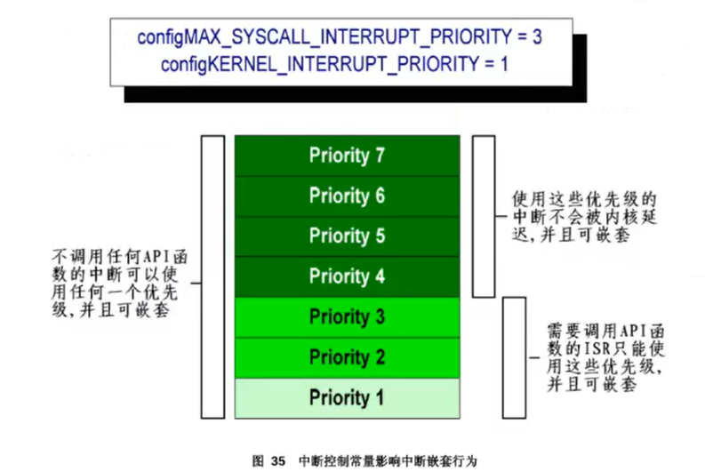


## Chapter 4 资源管理
多任务系统中存在一种潜在的风险。当一个任务在使用某个资源的过程中，即还没有完全结束对资源的访问时，便被切出运行态，使得资源处于非一致，不完整的状态。如果这个时候有另一个任务或者中断来访问这个资源，则会导致数据损坏或是其它相似的错误。本章致力于解决以上问题。
___
### 基本临界区
使用 `taskENTER_CRITICAL()`和`taskEXIT_CRITICAL()` 指定临界区，当进入临界区后，优先级较低的中断将被屏蔽，且不允许进行任务切换。通常在访问资源时进入临界区，以防止中断或任务的打断造成资源损坏。

````markdown
taskENTER_CRITICAL();//临界区开始
Foo();
Foo();
taskEXIT_CRITICAL();//临界区结束
````

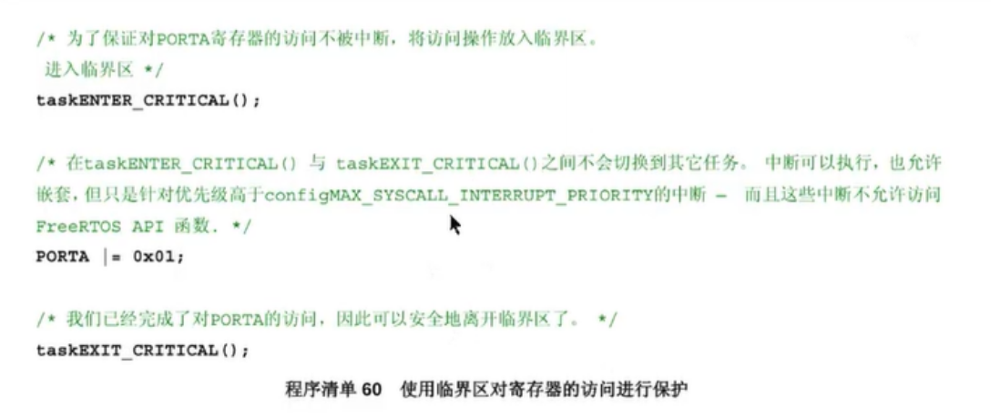


临界区是提供互斥功能的一种非常原始的实现方法。临界区的工作仅仅是简单地把中断全部关掉，或是关掉优先级在`configMAX_SYSCAL_INTERRUPT_PRIORITY`及以下的中断——依赖于具体使用的 FreeRTOS 移植。抢占式上下文切换只可能在某个中断中完成，所以调用 `taskENTER_CRITICAL()`的任务可以在中断关闭的时段一直保持运行态，直到退出临界区。==临界区必须只具有很短的时间，否则会反过来影响中断响应时间==。在每次调用`taskENTER_CRITICAL()`之后，必须尽快地配套调用一个 `taskEXIT_CRITICAL()`。临界区嵌套是安全的。
___
### 挂起调度器
通过挂起(暂停)调度器可以保护一段代码区间不被其它任务打断。==如果一个临界区太长而不适合简单地关中断来实现，可以考虑采用挂起调度器的方式，但是唤醒调度器却是一个相对较长的操作。==所以评估哪种是最佳方式需要结合实际情况，

1. `void vTaskSuspendAll(void)`
    用于挂起调度器。==此操作不影响中断==。如果某个中断在调度器挂起过程中要求进行上下文切换，则个这请求也会被挂起，直到调度器
    被唤醒后才会得到执行。
2. `portBASE_TYPE xTaskResumeAll(void)`
    用于唤醒调度器。如果一个挂起的上下文切换请求在`xTaskResumeAll()`返回前得到执行，则函数返回 `pdTRUE`。在其它情况下`xTaskResumeAll()`返回`pdFALSE` .

**嵌套调用` vTasksuspendAll()`和 `xTaskResumeAll()` 是安全的**

___
### 互斥量(互斥锁)
  互斥量是一种特殊的二值信号量，用于控制在两个或多个任务间访问共享资源。在用于互斥的场合，互斥量从概念上可看作是与共享资源关联的令牌。一个任务想要合法地访问资源，其必须先成功地**获取**该资源对应的令牌(信号量)，当令牌持有者完成资源使用，其必须马上**给出**令牌(信号量)。只有归还了令牌，其它任务才可能成功持有，也才可能安全地访问该共享资源。一个任务除非持有了令牌，否则不允许访问共享资源，这样做保证了同一时间内只有一个任务可以访问共享资源。(同一时间内只能有一个任务成功 获取信号量)

<div style="border-left: 3px solid #ccc; padding-left: 10px; color: #888;"> 此处的获取和给出与二值信号量中的获取和给出含义完全相同。 </div>

互斥量与普通的二值信号量最大的区别在于:
  。用于互斥的信号量**必须归还**。
  。用于同步的信号量通常是完成同步之后便丢弃，**不再归还**，

`xSemaphoreHandle xSemaphoreCreateMutex(void)`

用于创建互斥量。返回值为该函数创建的信号量的句柄，当内存不足创建失败时返回NULL。

___

### 优先级反转与优先级继承
采用互斥量提供互斥功能存在一个潜在缺陷:高优先级的任务竟然必须等待低优先级的任务放弃对互斥量的持有权。高优先级任务被低优先级任务阻寒推迟的行为被称为**优先级反转**。这是一种不合理的行为方式，如果把这种行为再进一步放大，当高优先级任务正等待信号量的时候，一个**介于两个任务优先之间的中等优先级任务**开始执行——==这就会导致一个高优先级任务在等待一个低优先级任务，而低优先级任务却无法执行==。
FreeRTOS中的互斥量自动提供了一个基本的**优先级继承机制**（不推荐），优先级继承是最小化优先级反转负面影响的一种方案一一其并不能修正优先级反转带来的问题，**仅仅是减小优先级反转的影响**，优先级继承使得系统行为的数学分析更为复杂，所以如果可以避免的话，**并不建议系统实现对优先级继承有所依赖**
由于最好是优先考虑避免优先级反转，并且因为 FreeRTOS 本身是面向内存有限的微控制器，所以只实现了最基本的互斥量的优先级继承机制，这种实现**假定一个任务在任意时刻只会持有一个互斥量**。

**优先级继承原理如下:**
优先级继承暂时地将互斥量**持有者**的优先级提升至所有等待此互斥量的任务所具有的**最高优先级**。持有互斥量的低优先级任务"继承"了等待互斥量的任务的优先级。互斥量持有者在归还互斥量时，优先会**自动设置为其原来的优先级**，这样做保证了低优先级任务在持有互斥量时不会被中等优先级任务抢占，从而导致高优先级任务无法执行。

___

### 死锁
死锁是利用互斥量提供互斥功能的另一个潜在缺陷。考虑以下情况:
任务 A 与任务 B 都需要获得互斥量X与互斥量Y以完成各自的工作:

1. 任务 A执行，并成功获得了互斥量X。
2. 任务 A 被任务 B抢占。
3. 任务 B成功获得了互斥量 Y，之后又试图获取互斥量X。  但互斥量X已经被任务 A持有，所以对任务 B无效。任务 B选择进入阻塞态以等待互斥量 x被释放。
4. 任务A得以继续执行。其试图获取互斥量 Y--但互斥量Y已经被任务 B持有而对任务A无效。任务A也选择进入阻寒态以等待互斥量Y被释放。

这种情形的最终结局是，任务A在等待一个被任务 B持有的互斥量，而任务B也在等待一个被任务A持有的互斥量。死锁于是发生，因为两个任务都不可能再执行下去了。
和优先级反转一样，避免死锁的最好方法就是在设计阶段就考虑到这种潜在风险，这样设计出来的系统就不应该会出现死锁的情况,

___

### 守护任务
**守护任务**是对某个资源具有**唯一所有权**的任务。只有守护任务才可以査接访问其守护的资源--其它任务要访问该资源只能**间接**地通过守护任务提供的服务。可以通过编写守护任务简单直接地实现互斥功能。


___


## Chapter5 内存管理
FreeRTOS将内存分配作为可移植层面。当内核清求内存时，其==调用`pvPortma11oc()`而不是直接调用ma11oc()==;当释放内存时，==调用 `vPortFree()`而不是直接调用free()==。pvPortma11oc()具有与ma11oc()相同的函数原型;vPortFree()也具有与 free()相同的函数原型，FreeRTOS 自带有三种 pvPortMa110c()与vPortFree()实现范例，这三种方式都会在本章描述，FreeRTOS 的用户可以选用其中一种，也可以采用自己的内存管理方式。这三个范例对应三个源文件:heap_1.c，heap_2.c，heap_3.c,heap_4.c(默认  )。

在cubeMX里面中选择模式：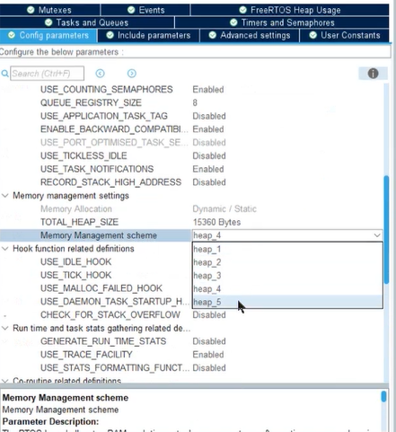

___

### Heap 1.c
Heap_1.实现了一个非常基本的 pvPortMalloc()版本，而且没有实现 vPortFree()。如果应用程序**不需要删除任务，队列或者信号量**,则具有使用heap_1的潜质。

这种分配方案是将FreeRTOS的内存堆空间看作一个简单的数组。当调用pvPortma11oc()时，则将数组又简单地细分为更小的内存块。数组的总大小(字节为单位)在` FreeRTOSconfig.h`中由 `configTOTAL_HEAP_SIZE`定义。以这种方式定义一个巨型数组会让整个应用程序看起来耗费了许多内存——即使是在数组没有进行任何实际分配之前。heap_1在创建任务创建时细分这个简单数组，为每个创建的任务在堆空间上分配一个任务控制块(TCB)和一个栈空间。

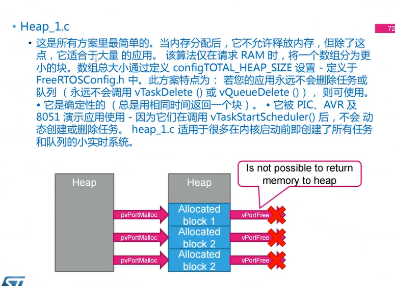

___

### Heap_2.c
Heap_2.c也是使用了一个由 configTOTAL_HEAP_SIZE定义大小的简单数组。不同于 heap_1 的是，heap_2 采用了一个最佳匹配算法来分配内存，并且支持内存释放，由于声明了一个静态数组，所以会让整个应用程序看起来耗费了许多内存--即使是在数组没有进行任何实际分配之前。最佳匹配算法保证 pvPortMa11oc()会使用最接近请求大小的空闲内存块
````mark
比如，考虑以下情形:
1.堆空间中包含了三个空闲内存块，分别为5字节，25 字节和 100 字节大小。
2.pvPortma11oc()被调用以请求分配 20 字节大小的内存空间。匹配请求字节数的最小空闲内存块是具有 25 字节大小的内存块--所以 pvPortma11oc() 会将这个 25 字节块再分为一个 20 字节块和一个5字节块 3，然后返回一个指向 20 字节块的指针。剩下的5字节块则保留下来，留待以后调用 pvPortMa11oc()时使用。
````
Heap_2.c 并不会把相邻的空闲块合并成一个更大的内存块，所以会产生**内存碎片**--如果分配和释放的总是相同大小的内存块，则内存碎片就不会成为一个问题。**Heap 2.c适合用于那些重复创建与删除具有相同栈空间任务的应用程序**

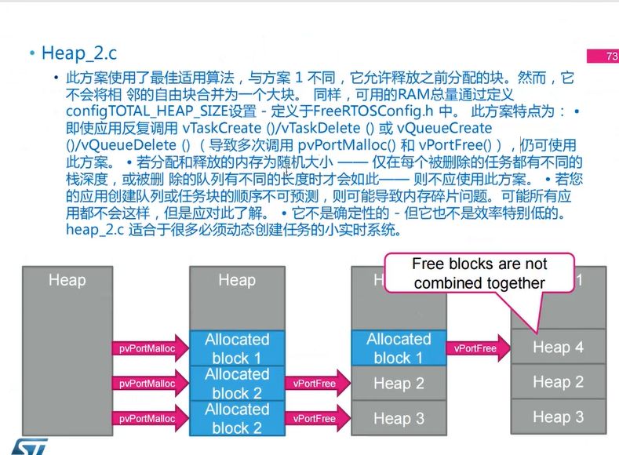

___

### Heap_3.c（最不常用）

Heap_3.c简单地调用了标准库函数ma110c()和free()，但是通过暂时挂起调度器使得函数调用备线程安全特性，此时的内存堆空间大小不受`configTOTAL_HEAP_SIZE`影响，而是由链接器配置决定

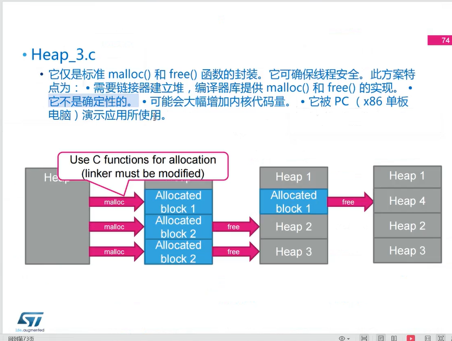


___

### Heap_4.c（默认）

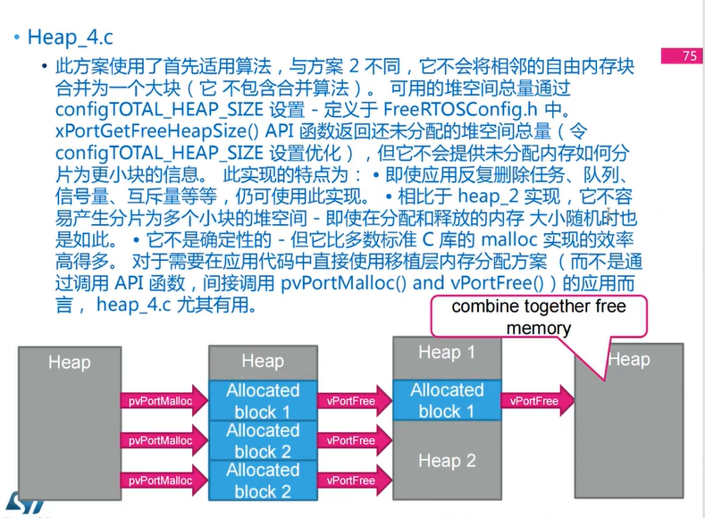


___

## Chapter6 错误排查
### printf-stdarg.c
当调用标准C库函数时，栈空间使用量可能会急剧上升，特别是IO 与字符串处理函数，比如 sprintf（）。在 FreeRTOS 下载包中有一个名为 printf-stdarg.c的文件。这个文件实现了一个栈效率优化版的小型 sprintf0)，可以用来代替标准C库函数版本。

___

### 栈溢出

1. `unsigned portBASE_TYPE uxTaskGetStackHighwaterMark(xTaskHandle xTask)`

    用于查询指定任务的运行历史中，其栈空间还差多少就要溢出。这个值被称为栈空间的高水线(High Water Mark)。参数1为目标任务的句柄，返回值为剩余的未使用的找空间。

2. `void vApplicationStackoverflowHook(xTaskHandle* pxTask, signed portCHAR* pcTaskName)`

  栈溢出钩子函数由内核在侦测到栈溢出时调用。
  要使用栈溢出钩子函数，需要进行以下配置:

- 在cubemx中打开

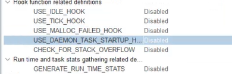

  - 在`FreeRTOSconfig.h`中把`configCHECK_FOR_STACK_OVERFLOW`设为1或 2.
  -   提供钩子函数的具体实现，采用上述函数名和函数原型，
      栈溢出钩子函数只是为了使跟踪调试栈空间错误更容易，而无法在栈溢出时对其进行恢复。函数的入口参数传入了任务句柄和任务名，**但任务名很可能在溢出时已经遭到破坏**。

  栈溢出钩子函数具有两种实现方法:
  - 当`configCHECK_FOR_STACK_OVERFLOW`设置为**1**时选用本方法
      任务被交换出去的时候，该任务的**整个上下文被保存到它自己的栈空间中**。这时任务栈的使用应当达到了一个峰值。内核会在任务上下文**保存后**检査栈指针是否还指向有效栈空间。一旦检测到，栈溢出钩子函数就会被调用。
    本方法具有**较快的执行速度**，但栈溢出有可能**发生在两次上下文保存之间**，这种情况不会被侦测到。
  
  - 当`configCHECK_FOR_STACK_OVERFLOW` 设置为 2  时选用本方法。
    方法2在方法1的基础上进行了一些补充。当创建任务时，任务栈空间中就预置了一个标记。方法2会检查任务栈的最后 20个字节，查看**预置在这里的标记数据是否被覆盖**。如果最后 20 个字节的标记数据与预设值不同，则栈溢出钩子函数就会被调用。方法2没有方法1的执行速度快，但测试仅仅 20 个字节相对来说也是很快的。这种方法应该可以侦测到**任何时候发生的栈溢出**，虽然理论上还是有可能漏掉一些情况，但这些情况几乎是不可能发生的，


___

## Chapter7事件标志(事件组)

事件是一种实现任务/中断间通信的机制，主要用于实现**多任务间的同步**。信号量/队列当事件发生时只会去唤醒一个任务，而事件组可以**唤醒多个任务**起到一个广摇的作用。信号量/队列是一个消耗性资源，即数据读走了则就减少，而事件组可以选择清除事件也可以选择保留事件。
事件仅用于同步，**不提供数据传输功能**。与信号量/队列不同，设置事件组**不会阻塞**，即多次向任务设置同一事件等效于只设置一次。
支持事件等待超时机制，即等待该事件类型(该事件还未发生)的任务会进入阻塞态。事件获取的时候，有两个选择:1.逻辑或:任务所期望的事件中只要有**任意一个事件发生**，任务即可被唤醒。2.逻辑与:任务所期望的事件必须全部发生，任务才能被唤醒。
在事件组中实现的位数(或标志数)取决于`configUSE_16_BIT _TICKS` or `configTICK_TYPE_WIDTH_IN_BITS` 是否 用于控制 TickType_t 的类型:

- 如果`configUSE_16_BIT_TICKS`设置为1，则事件组内实现的位数(或标志数)为8;如果`configUSE_16_BIT_TICKS`设置为0,则为24。
- 如果`COnfigTICK_TYPE_WIDTH_IN_BITS`设置为`TICK_TYPE_WIDTH_16_BITS`，则事件组内实现的位数(或标志数)为 8;如果`COnfigTICK_TYPE_WIDTH_IN_BITS`设置为`TICK_TYPE_WIDTH_32_BITS`,则为24;如果 `configTICK_TYPE_WIDTH_IN_BITS`设置为`TICK_TYPE_WIDTH_64_BITS`，则为56.

___
### 函数
- `EventGroupHandle_t xEventGroupcreat(void)`
    用于创建事件组，返回其对创建的事件组的句柄，若内存不足无法创建则返回NULL。==不能在中断中使用==
- `void vEventGroupDelete(EventGroupHandle_t xEventGroup)` 
    用于刚除事件组。参数1为目标事件组的句柄，==不能在中断中使用==
- `EventBits_t xEventGroupClearBits(EventGroupHandle_t xEventGroup, const EventBits_t uxBitsToclear)`用于清除事件组中的某些位。参数1为目标事件组的句柄，参数2为要清除的位，返回值为该函数执行完毕后事件组的值，==不能在中断中使用==

````markdown
例:在参数2中传入0x01|0x020x10清除位1，位2，位4
````

​             函数`BaseType_t xEventGroupClearBitsFromISR()`为其中断安全版本，只有返回值与其不同。

​			若操作成功则返回pdPASS，否则返回 pdFALSE。

- `EventBits_t xEventGroupsetits(EventGroupHandle_t EvenGroup, const EventBits_t uxBitsToset)`

    用于设置事件组中的某些位，参数1为目标事件组的句柄，参数2为要设置的位，返回值为该函数执行完毕后事件组的值。不能在中断中使用
    `BaseType_t xEventGroupsetBitsFromIsR(...,...,BaseType_t* pxHigherPriorityTaskwoken)`中断安全版本。参数1、2与上面函数完全相同，参数3的工作方式详见==?==。
    
- `EventBits_t xEventGroupwaitBits(const EventGroupHandle_t xEventGroup, const EventBits t uxBitsTowaitFor , const BaseType_t xClearOnExit, const BaseType_t xwaitForAllBits , TickType_t xTicksTowait)`
  
    用于在任务中读取事件组的某些位，未读到目标位的任务将进入阻塞态。==不能在中断中使用==
    
    参数1为目标事件组的句柄，参数2为要读取的位，参数5为阻寒超时时间，返回值为该函数执行完毕后事件组的值。若参数3设置为 pdTRUE，则读取完目标的位后将这些位清除掉。若设置为pdFALSE 则不清除。若参数4设置为pdTRUE，则要求读取的所有位均有效才算读取成功。若设置为,DdEALSE 则读取任何有效的位就算读取成功。
    
- `EventBits t xEventGroupGetBits(EventGroupHandle_t xEventGroup)`

    用于读取目标事件组的当前值，参数1为目标事件组的句柄，返回值为事件组当前值。==不能在中断中使用==

    XEventGroupGetBitsFromIsR()中断安全版本。参数和返回值与上面函数完全相同

    

    

___
## Chapter8任务通知

内存不足的时候用

想要使用任务通知，必须将`FreeRTOSconfig.h`中的宏定义 `configUSE_TASK_NOTIFICATIONS`设置为 1
在大多数情况下，任务通知**可以替代二值信号量、计数信号量、事件组**，也可以**替代长度为1的队列**(可以保存一个 32 位整数或指针值)。任务通知本质上为一个32位值，在任务创建时**随任务初始化**。一个任务**只有一个**任务通知值，这意味着使用任务通知一次只能向一个任务传递信息。因此，使用任务通知只能**轻量化地取代**某些场景下的信号量、事件组和队列，且**只能用于任务**。
只有**等待通知的任务**可以被阻塞。发送通知的任务，在任何情况下都**不会因为发送失败而进入阻塞态**。

___

### 函数

- `BaseType_t xTaskNotifyGive(TaskHandle_t xTaskToNotify)`
    当任务通知用于代替信号量时使用,==不能在中断中使用==
    用于给出任务通知。参数1为目标任务的句柄，返回值固定为pdPASs。void 
    `vTaskNotifyGiveFromIsR(...,BaseType_t* pxHigherPriorityTaskwoken)`
	中断安全版本。参数1与上面函数完全相同，参数2的工作方式详见==?==。
- `uint32_t ulTaskNotifyTake(BaseType_t xClearCountOnExit, TickType_t xTicksTowait)`
    当任务通知用于代替信号量时使用,==不能在中断中使用==
    用于获取任务通知，只能获取本任务的任务通知。参数2为阻塞超时时间，单位为tick。
	若参数1设置为 pdFALSE，则当此函数成功获取任务通知后将其量减1，模拟计数信号量。
	若参数1设置为 pdTRUE，则当此函数成功获取任务通知后将其量设为0，模拟二值信号量。返回值为此函数执行(递减或设为0)前任务通知的值，
- `BaseType_t xTaskNotify(TaskHandle_t xTaskToNotify, uint32_t ulValue, eNotifyAction eAction)`
	用于设置某个任务通知为有效态,==不能在中断中使用==
	参数1为日标任务的句柄，返回值固定为PdPASS

	`BaseType_t xTaskNotifyFrOmISR(... , ... , BaseType_t* pxHigherPriorityTaskWoken)`中断安全版本。参数1、2、3、4与上面函数完全相同，参数5的工作方式详见==?==
- `BaseType_t xTaskNotifywait(uint32_t uiBitsToClearOnEntry, uint32_t ulBitsToClearOnExit, uint32_t* puNotificationvalue,TickType_t xTicksTowait)`
用于获取任务通知。==不能在中断中使用==
传入参数1指定使用任务通知前需要置0的位。若调用此函数时任务通知已经有效则此参数不起作用。
传入参数2指定接受到任务通知后需要置0的位。此修改在任务通知保存到参数3后执行。
向参数1和2中传入ULONG_MAx以将所有位置0。
参数3用于保存接受到的任务通知值。如果不需要保存，则传入NULL。
参数4为阻塞超时时间。若超时则返回pdFALSE，否则返回pdTRUE。
- `BaseType_t xTaskNotifyStateClear(TaskHandle_t xTask)`
用于将目标任务通知变为无效状态。参数1为目标任务句柄，若存在有效通知可以设置的则返回pdTRUE，若通知已为无效状态则返回PdFALSE ==可以在中断中使用==
- `uint32_t ulTaskNotifyValueClear(TaskHandle_t xTask, uint32_t ulBitsToclear)`
用于将参数2中指定的目标任务通知的位置0。参数1为目标任务句柄，返回值为调用该函数前任务通知的值。可以在中断中使用

__
### 任务通知组
FreeRTOS V10.4.0版本后，每个任务将拥有一个任务通**数组**，而不仅仅只有一个任务通知值。同时增加了上述函数的Index版本增加了一个参数以使用任务通知数组中的不同任务通知值，数组中的任务通知值相互独立。
具体见官网


___
## Chapter9 软件定时器
FreeRTos实现了定时器，可以定期执行某个函数，称为定时器回调函数。
具体来说，FreeRTOS创建一个守护任务(定时器任务)，并在此任务中**挂起调度器**，执行回调函数，并定期阻塞该任务以实现定时器效果。因此，定时器回调函数中==不允许使用任何会阻塞任务的函数==，如`vTaskDe1ay()`。
守护任务的优先级和堆栈大小分别由`FreeRTOSconfig.h`中的`configTIMER_TASK_PRIORITY`和`configTIMER_TASK_STACK_DEPTH`设量。
每个定时器内置一个**定时器命令队列**，定时器命令队列的长度由 `FreeROSconfig.h`中的`configTIMER_QUEUE_LENGTH`设置。守护任务会根据此命令队列更改定时器的状态，定时器每循环1次执行1个命令。

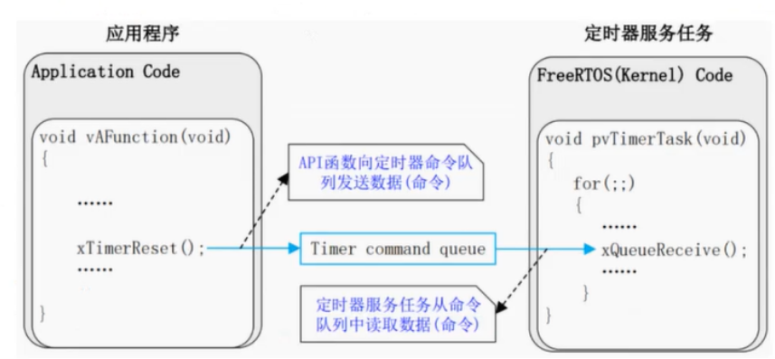

___

### 函数
- `void vcallBackFunction(TimerHandle_t xTimer)`
  回调函数原型，参数1为定时器句柄。

- `TimeHandle_t xTimerCreate(const char* const pcTimerName, const TickType_t xTimerPeriod, const uBaseType tusAutoReload, void* const pvTimerID, TimercallbackFunction_t pxcallbackFunction)`

    用于创建一个定时器。参数1为定时器名字，参数2为定时器周期，单位为tick，必须大于0，参数4用于向定时器分配ID，当同一个回调函数分配给了多个定时器时，此标识符可以识别哪个定时器已到期，参数5指定此定时器调用的回调函数。若向参数3传入 pdFALSE，则此定时器为一次性定时器，它会在到期后进入休眠状态。若传入pdTRUE，则定时器反复运行。返回值为其创建的定时器的句柄，若内存不足创建失败则返回NULL。

- `BaseType_t xTimerIsTimerActive(TimerHandle_t xTimer)`

  用于查询目标定时器是否活动。若休眠则返回pdFALSE。参数1为目标定时器的句柄。

- `BaseType_t xTimerStart(TimerHandle_t xTimer, TickType_t xBlockTime)`

    向命令队列发送启动定时器命令。参数1为目标定时器句柄，参数2为阻塞超时时间。超时返回 pdFALSE，否则返回 pdPAss 。

- `BaseType_t xTimerStop(TimerHande_t xTimer, TickType_t xBlockTime)`

    向命令队列发送停止定时器命令。参数1为目标定时器句柄，参数2为阻塞超时时间。超时返回pdFALSE，否则返回 pdPASS。

- `BaseType_t xTimerChangePeriod(TimgrHandle_t xTimer, TickType_t xNewPeriod, TickType_t xBlockTime)`

    向命令队列发送更改定时器周期命令。参数1为目标定时器句柄，参数2为更改后的定时器周期，参数3为阻寒超时时间。超时返回PdFALSE，否则返回pdPASS.

- `xTimerStartFromISR()`  `xTimerStopFromISR()`  `xTimerChangePeriodFromISR()`上述函数的中断安全版本。


___

## Chapter 10 CMSIS-RTOS2 API接口（V2）

### 内核控制
#### 数据结构

- `struct osVersion_t`标识底层的 RTOS 内核和 AP|版本号

- 标识内核状态。
````c
    enum osKernelState_t
    { 
        osKernelInactive = 0,//内核未初始化
        osKernelReady = 1，//内核已初始化。准备好运行
        osKernelRunning = 2，//内核正在运行
        osKernelLocked = 3，//内核锁定
        osKerne1suspended = 4，//内核挂起
        osKernelError = -1//发生错误
    	osKernelReserved =Ox7FFFFFFFU//保留，无意义
    }
````

___

#### 函数

- `osStatus_t osKernelInitialize(void)`
    用于初始化内核。不能在中断中使用
    可能返回:
    - osOK 初始化成功。
    - osError 发生错误。
    - osErrorISR 若从中断中使用
    - osErrorNoMemory 没有足够内存用于操作。
- `osKernelState_t osKernelGetState(void)`
用于获取内核目前状态。返回内核目前状态。可以在中断中使用
- `osStatus_t osKernelStart(void)`
        用于启动内核。不能在中断中使用
        可能返回:
        - 不返回，执行任务切换，
            - osError 发生错误。
            - osErrorISR 若从中断中使用。
- `int32_t osKernelLock(void)`  `int32_t osKernelUnlock(void)`
  用于锁定(解锁)内核，停止一切任务切换。不能在中断中使用可能返回:
        - 调用的数前内核的状态，若锁定返回1，解锁返回0。
        - osError,OSErrOrISR.

#### 不重要
以下函数非原型
- `osKerne1GetInfo()`用于检索内核版本,
- `osKerne1RestoreLock()`用于切换内核锁定状态。
- `osKerne1Suspend()`  `osKerne1Resume()`用于当无任务执行时，切换内核至低功耗模式
- `osThreadGetId()`用于获取当前正在运行的任务的句柄，
- `osThreadSetPriority()`用于为目标任务设置新优先级。
- `osThreadGetPriority()`用于获取目标任务的优先级。
- `osThreadGetStackSize()`用于获取为目标任务分配的空间大小。
- `osThreadGetStackSpace()`用于获取目标任务未使用的空间大小。
- `osThreadSetCount()`用于获取当前活动线程的个数。

__
### 队列
#### 数据结构
- `struct osMessageQueueAttr_t`用于配置队列的显性
#### 函数
- `osMessageQueueId_t osMessageQueueNew(uint32_t msg_count, uint32_t msg_size, const osMessageQueueAttr_t*attr)`
用于创建队列。=-**不能在中断中使用**
参数1为队列深度，参数2为一个单元的长度，单位为字节，参数3为队列属性，传入NULL表示畎认，返回值为其创建的队列的句柄
- `osStatus_t osMessageQueuePut(osMessageQweueId_t msg_id, const void* msg_ptr, uint8 _t msg_prio, uint32_t timeout)`
	用于向队列写入信息。如果timeout 设置为0则可以在中断中使用
	参数1为队列句柄，参数2为要写入的信息指针，参数3为信息优先级，用于对消息进行排序，不需要优先顺序时传入NULL，参数4为阻塞超时时间，传入oswaitForever表示无限时间。
	可能返回:
	- SOK
	- osErrorTimeout 阻塞超时
	- osErrorResource 当timeout为0时若队列没有足够空间时返回该值。
	- osErrorParameter队列句柄不存在
- `osStatus_t osMessageQueueGet(osMessageQueueId_t msg_id, const void* msg_ptr, uint_t msg_prio, uint32_t timeout)`
用于从队列读取信息。如果 timeout 设置为0则可以在中断中使用
参数1为队列句柄，参数2为读取信息后存入的内存指针，参数3为信息优先级变量指针，用于存储其读取消息的优先级，参数4为阻塞超时时间，传入oswaitForever表示无限时间。
- `osStatus_t osThreadYield(void)`
	在任务中调用，用于立即切换至下一个具有相同优先级且处于准备状态的任务。不能在中断中使用可能返回:
	- osOK 任务成功切换。
	- osError osErrOrISR
- `osStatus_t osThreadSuspend(osThreadId_t thread_id)`
	用于挂起任务。不能在中断中使用
	参数1为目标任务的句柄。
	可能返回:
	- osOK 目标任务成功挂起。
	- osErrorParameter 传入的目标任务的句柄不存在，
	- osErrorResource 传入的目标任务为无效状态
	- OSErrOrISR
- `osStatus_t osThreadResume(osThreadId_t thread_id)`
	用于解挂任务。不能在中断中使用
	参数1为目标任务的句柄。
	可能返回:
	- osoK 目标任务成功解挂。
	- osErrorParameter osErrorResource osErrorISR
- `osStatus_t osThreadTerminate(osThreadId_t thread_id)`
用于刚除目标线程。不能在中断中使用参数1为目标任务的句柄，可能返os0K,osErrorParameter,osErrorResource,osErrorIsR
- `void osThreadExit(void)`
任务函数需要退出时使用该函数。不能在中断中使用

#### 不重要
- `osThreadGetName()`用于获取任务的名字，
- `osThreadGetId()`用于获取当前正在运行的任务的句柄，
- `osMessageQueueGetspace()`用于获取目标队列中剩余空单元的数量，
- `osMessageQueueReset()`用于重置目标队列，
- `osMessageQueueDelete()`用于删除目标队列

___
###信号量
#### 数据结构
- `struct osSemaphoreAttr_t` 用于配置信号量的属性。
#### 函数
- `osSemaphoreId_t osSemaphoreNew(uint32_t max_count, uint32_t initial _count, const osSemaphoreAttr_t* att)`
用于创建信号量。不能在中断中使用
参数1为可用令牌的最大数量，传入1会创建一个二值信号量，参数2为可用令牌的初始数量，参数3为信号量属性，传入NULL表认，返回值为其创建信号量的句柄，
- `osStatus_t osSemaphoreAcquire(osSemaphoreId_t semaphore_id, uint32_t timeout)`
用于获取信号量。如果timeout设置为0则**可以在中断中使用**
参数1为目标信号量的句柄，参数2为阻寒超时时间。
可能返回:osOK ,osErrorTimeout ,osErrorResource ,osErrorparameter
- `osStatus_t osSemaphoreRelease(ossemaphoreId_t semaphore id)`
用于给出信号量。可以在中断中使用
参数1为目标信号量的句柄。
可能返回:osOK ,osErrorResource ,osErrorParameter

####不重要
- `osSemaphoreGetName()`用于获取目标信号量的名字，
- `osSemaphoreGetcount()`用于获取目标信号量的可用令牌的数量。
- `osSemaphoreDelete()`用于删除目标信号量

___
### 延时
#### 函数
- osStatus_t osDelay(uint32_t ticks)`
- `osStatus_t osDelayUntil(uint32_t ticks)`
	用于阻塞延时，不能在中断中使用
	参数1为延时时间，单位为ms。
	可能返回:
	- OSOK OSErTOrISR
	- osParameter 只有第2个函数可能返回，当延时时间过长时返回,

___
### 互斥量
#### 数据结构
- `struct osMutexAttr_t` 用于配置互斥量的属性
#### 函数
- `osMutixId_t osMutexNew(const osMutesAttr_t* attr)`
用于创建互斥量。不能在中断中使用
参数1为互斥量属性，传入NULL表示默认属性，返回其创建的互斥最句柄。
- `osStatus_t osMutexAcquire(osMutexId_t mutex_id, uint32_t timeout)`
用于获取互斥量。不能在中断中使用
参数1为目标互斥量句柄，参数2为阻塞超时时间。
可能返回:osOK ,osErrorTimeout ,osErrorParameter ,osErrorResource osErrorISR
- `osStatus_t osMutexRelease(osMutexId_t mutex_id)`
用于给出互斥量。不能在中断中使用
参数1为目标互斥量的句柄。
可能返回:osOk ,osErrorResource ,osErrorParameter ,osErrorISR

#### 不重要
- `osMutexGetwame()`用于获取目标互斥量的名字。
- `osMutexGetowner()`用于获取当前占有目标互斥量任务的句柄，
- `osMutexDelete()`用于别除目标互斥量


___
## 事件标志
### 数据结构
- `struct osEventFlagsAttr_t` 用于配置事件标志集的属性
### 函数
- `osEventFlagsId_t osEventFlagsNew(const osEventFlagsAttr_t* attr)`
用于创建事件标志。参数1为事件标志的属性传入NULL表示默认，返回其创建的事件标志句柄。不能在中断中使用
- `uin32_t osEventFlagsset(osEventFlagsId_t ef_id, uint32_t flags)`
	用于设置事件标志的某些位。参数1为目标事件标志的句柄，参数2为要设置的位。，可以在中断中使用可能返回:
	- 设置后的事件标志值
	- osFlagsErrorunknown:发生未指定的错误:
	- osFlagsErrorResource:目标事件标志尚未准备好被使用


___


## 注释

[^1]:`获取和给出为信号量术语的转译，分别等同于P(S)和V(S)。P 源自荷兰语 Parseren，即英语的 Pass;V源自荷兰语 Verhoog，即英语的 Increment。P(S)N(S)操作是信号量的两个原子操作，S 为信号量 Semaphore。`