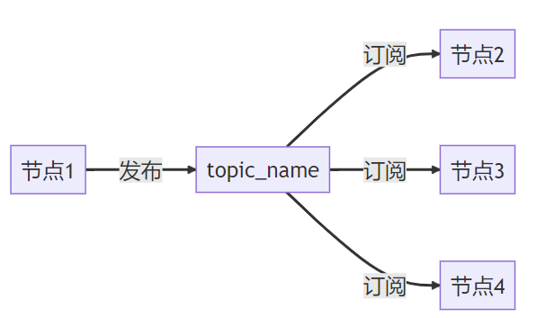
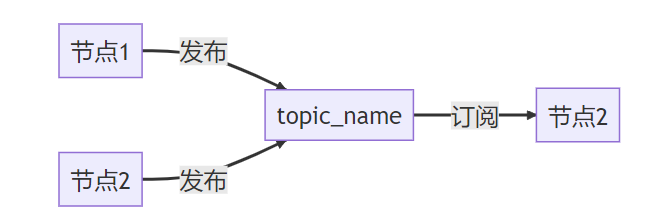
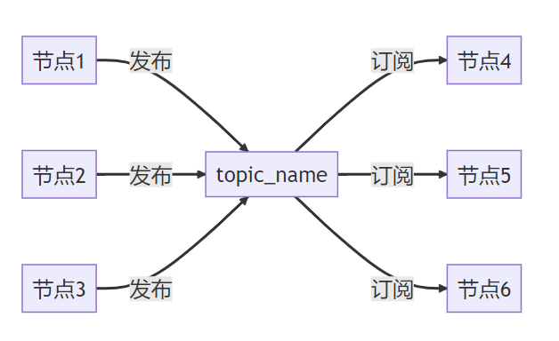
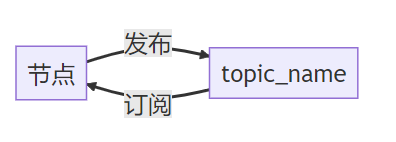
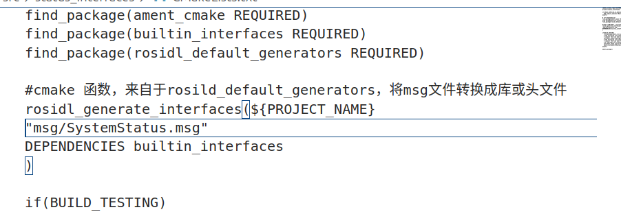
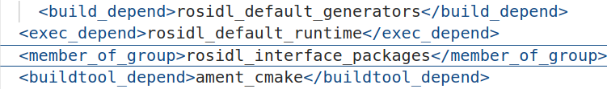
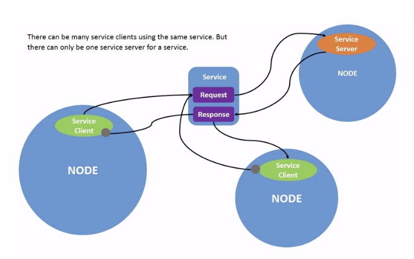
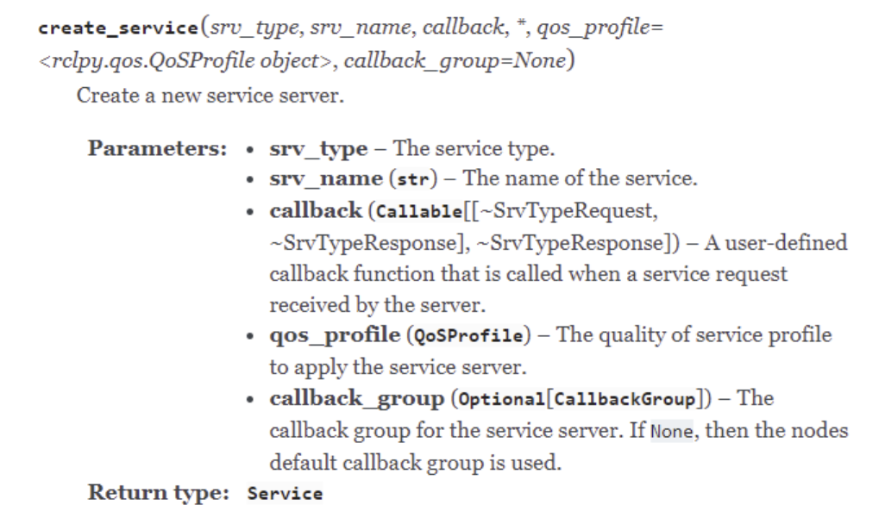
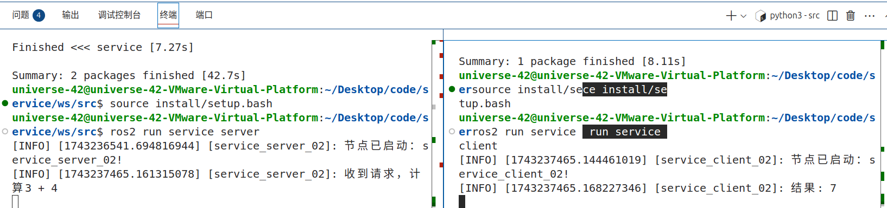
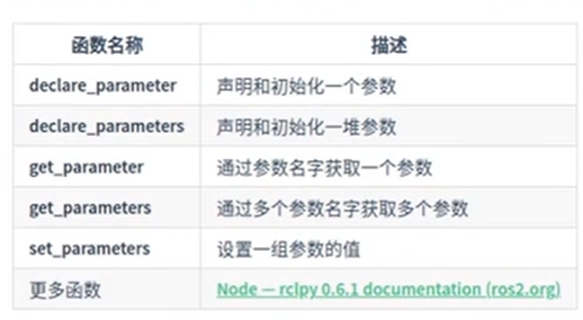

#  节点通信


# [API官方文件](https://docs.ros2.org/latest/api/rclpy/api/node.html)

## 一、话题

### 1. 订阅发布模型

- 话题通信有 **发布者**和 **订阅者**

- 方式：

1v1


1vn



n对1



nvn



ROS2特有的：*可以订阅本身发布的话题*



___


### 2. 消息接口

- **同一个话题，所有的发布者和接收者必须使用==相同消息接口==**
- 定义好消息接口后，ROS2会根据消息接口内容生成不同的接口类，在不同编程语言中调用相同的类即可实现无感的消息序列化和反序列化[^1]。
- 可以用`ros2 interface package <功能包名>`来查看一个接口包里面所有的接口，常见的接口包`sensor_msgs`

	### 自定义接口

- 分为自定义话题、服务、动作接口三种
- 话题：`xxx.msg`中罗列需要的接口组合
- 服务：`xxx.srv`中

````python
int64 a   (请求的接口类型)
int64 b
---       （用三个-分隔）
int64 sum  （响应的接口类型）
````

- 动作：`xxx.action`中

````python
int32 order   #目标的接口
---
int32[] sequence    #反馈的接口
---
int32[] partial_Sequence   ##结果的接口
````

⚠️ 关键注意事项

    文件名必须首字母大写
    ROS 2 会将接口名称转换为驼峰式（如 addtwoint → Addtwoint），但最佳实践是手动保持大写：
    
        ❌ addtwoint.srv
    
        ✅ AddTwoInt.srv
    
    禁止使用src子目录
    接口文件必须直接放在包目录下的 msg/ 或 srv/ 中。

### 3. 话题有关的CLI

 (1) `ros2 topic -h`
一键查询！

 (2) `ros2 topic list`
列出当前活跃的所有主题列表

 (3) `ros2 topic list -t`
列出所有活跃的话题，并且输出每个话题的消息类型[^2]（`-t 或者 --show -type`）

 (4) `ros2 topic info <topic_name>`
查看某个话题的详细信息（包括消息类型）

(5) `ros2 topic echo  <topic_name>`  
实时显示指定话题上发布的消息内容,以直接查看话题中传输的数据.

 (6) `ros2 topic echo <topic_name> <message_type>`
<message_type>的常用选项：**`-w <N>`**控制终端显示的列宽（防止长字段被截断）；**`-n <N>`**限制显示的消息数量；**`-f`**强制显示完整字段（不折叠嵌套消息）；**`--filter <expression>`**过滤显示特定字段。

 (7) `ros2 interface show <interface_type>`:thumbsup:

interface_type 可以是消息（msg）、服务（srv）或动作（action）。用于查看**接口的==详细定义==** 的命令。它可以显示接口的数据结构、字段名称、类型及注释。

 (8) `ros2 topic pub <话题名称> <消息类型> '<消息内容>'`：**向指定话题手动发布消息**，如：

    ```
    ros2 topic pub /cmd_vel geometry_msgs/msg/Twist "{linear: {x: 0.5}, angular: {z: 0.2}}"
    ```


​    

:watermelon:`ros2 interface show`、`ros2 topic echo` 和 `ros2 topic info` 的区别总结：            

| 命令                  | 核心功能                 | 输出内容                 | 依赖条件                 |
| :-------------------- | :----------------------- | :----------------------- | :----------------------- |
| `ros2 interface show` | 显示接口定义（静态结构） | 消息/服务/动作的字段定义 | 接口定义存在即可         |
| `ros2 topic echo`     | 显示实时数据（动态内容） | 消息的具体值             | 话题需有数据正在传输     |
| `ros2 topic info`     | 显示通信状态（元数据）   | 消息类型、发布者/订阅者  | 话题需存在且处于活动状态 |

------

- **`interface show`**：面向开发者，解决 **“数据长什么样？”**。
- **`topic echo`**：面向调试者，解决 **“数据是什么？”**。
- **`topic info`**：面向系统诊断，解决 **“谁在通信？”**。

#### 运用

- 如果话题无数据输出，需检查：
    - 话题是否被正确发布（用 `ros2 topic list` 确认）。
    - 消息类型是否匹配（用 `ros2 topic info <topic_name>` 查看）。
    
- 按 **`Ctrl+C`** 可退出监听。

   

### **自定义接口的代码实现**

1. 在src下创建功能包 **此时必须用ament_cmake**(默认)可以不指定

`ros2 pkg create status_interfaces --dependencies builtin_interfaces rosild_default_generators --license Apache-2.0`

- builtin_interfaces:建立时间戳
- rosidl_default_generators:转换成c++、python源码的形式
- 证书--license：Apache-2.0

*其中创建的include和src都用不到*

2. 在status_interfaces下创建文件夹`msg``srv`(文件夹名字是规定好的)
3. 在msg创建自定义接口，名字是驼峰式**首字母必须大写**`SystemStatus.msg`,后缀也是规定好的
4. 编写内容

````
builtin_interfaces/Time stamp #记录时间戳
string host_name #主机名字
float32 cpu_precent #cpu使用率
float64 net_sent #网络发送数据总量 
float64 net_receive #网络接受数据总量
````

==如果自定义接口依赖于其他功能包中，ros2 interface list | grep Time
    builtin_interfaces/msg/Time中就不能出现msg，就如上内容所示那么写==（buildtin_interfaces来自与builtin_interfaces/msg的功能包里）

5. 到CmakeList.txt中修改

    ==rosidl==是i d l

rosidl_generate_interfaces函数的第一个参数${PROJECT_NAME},第二个参数是创建的自定义接口包的名字，有多个就分行写；第三个参数是如果自定义接口依赖于其他功能包就要指出依赖

## 

​                     6.package.xml添加命令

申明添加的功能包的类型member_of_group（这里是包含自定义接口的功能包）




​                                                                                                                                                                                                                                                                                                                                                                                                                                                                                                                                                                                                                                                                                                                                                                                                                                                                                                                                                                                                                                                                                                                                                                                                                                                                                                                                                                                                                                                                                                                                                                                                                                                                                                                                                                                                                                                                                                                                                                                                                                                                                                                                                                                                                                                                                                                                                                                                                                                                                                                                                                                                                                                                                                                                                                                                                                                                                                                                                                                                                                                                                                                                                                                                                                                                                                                                                                                                                                                                                                                                                                                                                                                                                                                                                                                                                                                                                                                                                                                                                                                                                                                                                                                                                                                                                                                                                                                                                                                                                                                                                                                                                                                                                                                                                                                                                                                                                                                                                                                                                                                                                                                                                                                                                                                                                                                                                                                                                                                                                                                           

### 4. 话题的代码实现

#### 1.创建功能包和节点

创建功能包

```
cd chapt3/chapt3_ws/src/
ros2 pkg create example_topic_rclpy  --build-type ament_python --dependencies rclpy
```

创建节点文件

```
cd example_topic_rclpy/example_topic_rclpy
touch topic_subscribe_02.py
touch topic_publisher_02.py
```

简单编写下代码，依然采用类的形式

发布者

```
#!/usr/bin/env python3
import rclpy
from rclpy.node import Node

class NodePublisher02(Node):
    def __init__(self,name):
        super().__init__(name)
        self.get_logger().info(f"大家好，我是{name}")

def main(args=None):
    rclpy.init(args=args) # 初始化rclpy
    node = NodePublisher02("topic_publisher_02")  # 新建一个节点
    rclpy.spin(node) # 保持节点运行，检测是否收到退出指令（Ctrl+C）
    rclpy.shutdown() # 关闭rclpyCopy to 
```

订阅节点

```
#!/usr/bin/env python3
import rclpy
from rclpy.node import Node

class NodeSubscribe02(Node):
    def __init__(self,name):
        super().__init__(name)
        self.get_logger().info("大家好，我是%s!" % name)

def main(args=None):
    rclpy.init(args=args) # 初始化rclpy
    node = NodeSubscribe02("topic_subscribe_02")  # 新建一个节点
    rclpy.spin(node) # 保持节点运行，检测是否收到退出指令（Ctrl+C）
    rclpy.shutdown() # 关闭rclpy
```

setup.py（Python 脚本映射为可在终端中直接调用的命令）

```
    entry_points={
        'console_scripts': [
            "topic_publisher_02 = example_topic_rclpy.topic_publisher_02:main",
            "topic_subscribe_02 = example_topic_rclpy.topic_subscribe_02:main"
        ],
    },
```

#### 2.编写订阅者

```
import rclpy
from rclpy.node import Node
'''1.导入消息类型'''
from std_msgs.msg import String


class NodeSubscribe02(Node):
    def __init__(self,name):
        super().__init__(name)
        self.get_logger().info("大家好，我是%s!" % name)
        ''' 2.创建订阅者'''
        self.command_subscribe_ = self.create_subscription(String,"command",self.command_callback,10)

    def command_callback(self,msg):
        speed = 0.0
        if msg.data=="backup":
            speed = -0.2
        self.get_logger().info(f'收到[{msg.data}]命令，发送速度{speed}')
```

#### 3.编写发布者

```
import rclpy
from rclpy.node import Node
'''1.导入消息类型'''
from std_msgs.msg import String

class NodePublisher02(Node):
    def __init__(self,name):
        super().__init__(name)
        self.get_logger().info("大家好，我是%s!" % name)
        ''' 2.创建发布者'''
        self.command_publisher_ = self.create_publisher(String,"command", 10) #传入的参数为：消息类型，话题名字，队列大小
        '''3.具体发布'''
        self.timer_period = 0.5
        self.timer = self.create_timer(self.timer_period, self.timer_callback)#创建定时器
    
    def timer_callback(self):
        """
        定时器回调函数
        """
        msg = String() #创建字符串类的消息
        msg.data = 'backup' #消息内容
        
        self.command_publisher_.publish(msg) #发布者发布消息
        self.get_logger().info(f'发布了指令：{msg.data}')    #打印一下发布的数据
```

#### 4.运行测试

发布节点：


```
cd chapt3/chapt3_ws/
source install/setup.bash
ros2 run example_topic_rclpy topic_publisher_02
```

订阅节点

```
cd chapt3/chapt3_ws/
source install/setup.bash
ros2 run example_topic_rclpy topic_subscribe_02
```


##  

##  

___


## 二、服务

### 1. 介绍

- 服务分为客户端和服务端（请求-响应模型）
- 服务分为客户端和服务端
- 服务端的名字是唯一的，不用有多个服务端用相同的服务名




### 2. 服务有关的CLI

#### (1)查看服务列表

```
ros2 service list
```

#### (2)手动调用服务

````python
ros2 service call <服务名称> <服务类型> "<请求数据>"
````

如：

```
ros2 service call /add_two_ints example_interfaces/srv/AddTwoInts "{a: 5,b: 10}"
```

如果不写参数值调用会默认参数为0

```
ros2 service call /add_two_ints example_interfaces/srv/AddTwoInts
```


#### (3) 查看服务接口类型

```
ros2 service type <服务名称>
```

#### (4)查找使用某一接口的服务

这个命令看起来和3.3刚好相反。

```
ros2 service find <服务类型>
```

如：

```
ros2 service find example_interfaces/srv/AddTwoInts
```

#### (5)查看接口定义

`ros2 interface show <接口类型>`

____


### 3. 代码实现

#### 创建功能包和节点（可同时创）

dependencies（依赖）：rclpy和自定义接口my_interfaces

```
cd chapt3/chapt3_ws/src
ros2 pkg create service_rclpy --build-type ament_python --dependencies rclpy my_interfaces  --node-name service_server_02
```

接着你会惊奇的发现，依赖，setup.py中的安装配置，ROS2都帮你加好了。:crying_cat_face:

这是因为 `--node-name service_server_02`会帮你创建好节点文件和添加执行文件。

但是也有一些限制，比如只支持一个节点文件，所以我们还需要手动创建一个。

```
cd example_service_rclpy/example_service_rclpy/
touch service_client_02.py
```

修改下setup.py

```
    entry_points={
        'console_scripts': [
            "service_client_02 = example_service_rclpy.service_client_02:main",
            "service_server_02 = example_service_rclpy.service_server_02:main"
        ],
    },
```

节点的代码写写：

service_server_02

```
#!/usr/bin/env python3
import rclpy
from rclpy.node import Node

class ServiceServer02(Node):
    def __init__(self,name):
        super().__init__(name)
        self.get_logger().info("节点已启动：%s!" % name)
        
def main(args=None):
    rclpy.init(args=args) # 初始化rclpy
    node = ServiceServer02("service_server_02")  # 新建一个节点
    rclpy.spin(node) # 保持节点运行，检测是否收到退出指令（Ctrl+C）
    rclpy.shutdown() # 关闭rclpy

```

service_client_02

```
#!/usr/bin/env python3
import rclpy
from rclpy.node import Node
from example_interfaces.srv import AddTwoInts

class ServiceClient02(Node):
    def __init__(self,name):
        super().__init__(name)
        self.get_logger().info("节点已启动：%s!" % name)

def main(args=None):
    rclpy.init(args=args) # 初始化rclpy
    node = ServiceClient02("service_client_02")  # 新建一个节点
    node.send_request(3,4)
    rclpy.spin(node) # 保持节点运行，检测是否收到退出指令（Ctrl+C）
    rclpy.shutdown() # 关闭rclpy
```


#### 服务端

请看API:arrow_down:



- 导入接口

- 如果是自定义接口要在package.xml的dependencies里面添加自定义interface

    

````python
import rclpy
from rclpy.node import Node
from status_interfaces.srv import AddTwoInts

class ServiceServer02(Node):
    def __init__(self,name):
        super().__init__(name)
        self.get_logger().info("节点已启动：%s!" % name)
        self.add_ints_server_ = self.create_service(AddTwoInts,"add_two_ints_srv", self.handle_add_two_ints) 

    def handle_add_two_ints(self,request, response):
        self.get_logger().info(f"收到请求，计算{request.a} + {request.b}")
        response.sum = request.a + request.b
        return response
        
def main(args=None):
    rclpy.init(args=args) # 初始化rclpy
    node = ServiceServer02("service_server_02")  # 新建一个节点
    rclpy.spin(node) # 保持节点运行，检测是否收到退出指令（Ctrl+C）
    rclpy.shutdown() # 关闭rclpy
````


​    

 #### **客户端**

​    

client.py

```
import rclpy
from rclpy.node import Node
from status_interfaces.srv import AddTwoInts


class ServiceClient02(Node):
    def __init__(self, name):
        super().__init__(name)
        self.get_logger().info("节点已启动：%s!" % name)
        # 创建服务客户端
        self.client = self.create_client(AddTwoInts, 'add_two_ints_srv')
        while not self.client.wait_for_service(timeout_sec=1.0):
            self.get_logger().info('服务不可用，等待中...')

    def send_request(self, a, b):
        # 创建请求对象
        request = AddTwoInts.Request()
        request.a = a
        request.b = b
        # 发送请求
        future = self.client.call_async(request)
        rclpy.spin_until_future_complete(self, future)
        if future.result() is not None:
            self.get_logger().info(f"结果: {future.result().sum}")
        else:
            self.get_logger().error('服务调用失败')


def main(args=None):
    rclpy.init(args=args)  # 初始化rclpy
    node = ServiceClient02("service_client_02")  # 新建一个节点
    node.send_request(3, 4)
    rclpy.spin(node)  # 保持节点运行，检测是否收到退出指令（Ctrl+C）
    rclpy.shutdown()  # 关闭rclpy
```

####  测试

```
colcon build --packages-select example_service_rclpy
source install/setup.bash
ros2 run example_service_rclpy service_server_02
```




打开新终端

```
ros2 service call /add_two_ints_srv examp
```


## **服务和话题总结**

1. 话题

- 话题是单向的，而且不需要等待服务器上线，数据实时性高，频率高
- 实时性强的**传感器**数据的传递一般用话题

2. 服务

- 服务是双向的，客户端发送请求后服务端有响应
- 频率低，强调服务特性和反馈场景的一般用服务


## 参数

### 介绍

- 参数是节点的一个配置，如显示屏的亮度一样从外部传入参数改变亮度
- 参数的组成：参数由“键-值”对组成，键就是参数的名字，值就是对应的数值
- 名字的类型：字符串
- 值的类型：布尔型，int，float，string，byte[]（字节数组，可以用来表示图片、节点等信息）

___

### 参数的CLI

-  `ros2 param list`

- `ros2 param describe /<node name> <param name>`:查看参数的具体信息

- `ros2 param get /<node name> <param name>`:获得参数的具体值

- `ros2 param set /<node name> <param name> <value>`:改变对应参数的值（**对参数值的修改只是临时的，不会改变默认值**，下次打开还是原来的样子）

- `ros2 param dump /<node name>`:保存当前设定的参数值，并生成个.yaml文件来存

    （可以用`cat node_name.yaml`来查看保存的参数值）

- `ros2 param load /<node_name> ./<node_name>.yaml`:加载之前保存的参数值

- `ros2 run <package name> <node name> --ros-args --params-file ./<node_name>.yaml `:在加载节点的时候自动加载之前保存的参数文件

### 代码实现

rclpy.node.Node里面的参数函数有




#### 1.声明参数

````python
self.declare_parameter("参数名"，默认值)
````

#### 2. 获取参数

````python
a = self.get_parameter("参数名").get_parameter_value().integer_value #以整型的方式获取参数
````


- `ros2 topic hz /<node_name> `可以来查看话题发布的**平均**频率


## 


##  


##  


___


### **补充**

[^1]: 序列化是将**对象或数据结构**转换为**可存储或传输**的格式（如字节流、JSON、XML等）的过程。序列化后的数据可以**保存到文件、数据库或通过网络发送**。反序列化将序列化后的数据**恢复为原始对象或数据结构**的过程。

[^2]:消息类型有**ROS 2 标准消息类型**和**用户自定义消息类型**两类

### 1.标准消息类型：

#### **(1) `std_msgs`**

- **基础数据类型**：用于简单数据传递。
    - `Bool`：布尔值（true/false）
    - `Int32`、`Int64`：整数
    - `Float32`、`Float64`：浮点数
    - `String`：字符串
    - `Empty`：空消息（用于触发信号）

#### **(2) `geometry_msgs`**

- **几何和运动控制**：
    - `Twist`：速度指令（线速度 `linear` + 角速度 `angular`）
    - `Pose`：位姿（位置 `position` + 方向 `orientation`）
    - `Point`：三维坐标点
    - `Quaternion`：四元数（表示旋转）

#### **(3) `sensor_msgs`**

- **传感器数据**：
    - `Image`：图像数据（RGB/深度图）
    - `LaserScan`：激光雷达扫描数据
    - `Imu`：惯性测量单元数据（加速度、角速度）
    - `PointCloud2`：点云数据

#### **(4) `nav_msgs`**

- **导航相关**：
    - `Odometry`：里程计数据（位置、速度）
    - `Path`：路径规划结果（一系列位姿）

#### **(5) `tf2_msgs`**

- **坐标变换**：
    - `TFMessage`：坐标变换树（用于描述不同坐标系之间的关系）

------

### **2. 服务类型（Service Types）**

服务（Service）是请求-响应模型的接口，通过 `.srv` 文件定义，包含 **请求（Request）** 和 **响应（Response）** 两部分。常见服务类型：

#### **(1) `example_interfaces/srv/AddTwoInts`**

- **功能**：计算两个整数之和。

- **定义**：

    yaml

    复制

    ```
    int64 a   # 请求参数
    int64 b
    ---
    int64 sum # 响应结果
    ```

#### **(2) `std_srvs/srv/SetBool`**

- **功能**：设置布尔状态。

- **定义**：

    yaml

    复制

    ```
    bool data  # 请求参数
    ---
    bool success # 响应是否成功
    ```

------

### **3. 动作类型（Action Types）**

动作（Action）是用于长时任务的接口，通过 `.action` 文件定义，包含 **目标（Goal）**、**反馈（Feedback）** 和 **结果（Result）** 三部分。常见动作类型：

#### **(1) `example_interfaces/action/Fibonacci`**

- **功能**：生成斐波那契数列。

- **定义**：

    yaml

    复制

    ```
    int32 order          # 目标：生成数列的阶数
    ---
    int32[] sequence     # 结果：最终生成的数列
    ---
    int32[] partial_sequence # 反馈：当前已生成的部分
    ```

#### **(2) `nav2_msgs/action/NavigateToPose`**

- **功能**：导航到目标位姿。

- **定义**：

    yaml

    复制

    ```
    geometry_msgs/PoseStamped pose  # 目标位姿
    ---
    bool success                    # 结果：是否成功
    ---
    geometry_msgs/PoseStamped current_pose # 反馈：当前位置
    ```

------

### **4. 自定义消息类型**

如果标准消息无法满足需求，可以**自定义消息**：

1. **创建 `.msg` 文件**：
    在功能包的 `msg` 目录下定义消息结构（如 `MyMessage.msg`）：

    复制

    ```
    float32 temperature
    string location
    std_msgs/Header header  # 支持嵌套其他消息
    ```

2. **修改 `CMakeLists.txt` 和 `package.xml`**：
    添加对 `rosidl_default_generators` 的依赖，并注册消息文件。

3. **编译**：

    bash

    复制

    ```
    colcon build --packages-select your_package
    ```

