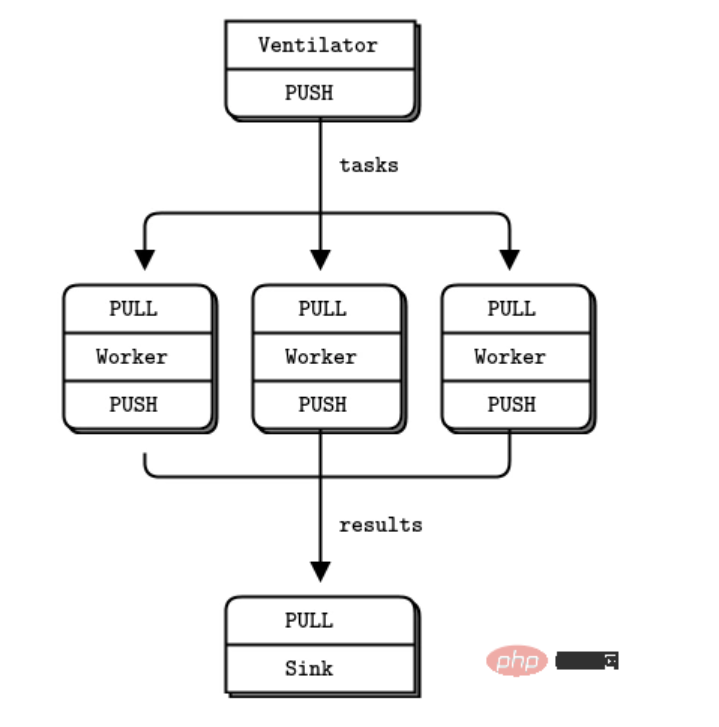

# ZeroMQ

[详见](https://www.php.cn/faq/459626.html)

## 一、介绍

ZMQ是一个**消息处理队列**，可在多个线程、内核和主机盒之间弹性伸缩。

实际上只一个消息列队组件，一个库。

ZeroMQ并不是一个对socket的封装，**不能用它去实现已有的网络协议。**


## 二、几种模式

### 1. 请求应答模式（Request-Reply）

- 消息**双向**的，有来有往

- req端（客户端）请求的消息，rep端（服务端）**必须答复**给req端。
- 当应用程序发送一个请求时，ZMQ 会自动在请求中隐含一个回应地址信息。这个回应地址用于让接收方知道应该将响应发送到哪里。
- 对于应用程序来说，它**不需要手动**去设置或者管理这个回应地址，也不需要关心具体的回应路径和地址信息。应用程序只需要专注于发送请求和处理接收到的响应，而底层的地址管理和路由选择等细节都由 ZMQ 的路由功能来处理，从而简化了应用程序的开发和维护。

### 2. 订阅发布模式（Publish和Subscribe）

- 消息**单向**的，有去无回的。
- 发布端可发布制定主题的消息，订阅端可订阅喜欢的主题
- 订阅端**只会收到**自己**已经订阅**的主题。发布端发布一条消息，可被多个订阅端同时收到

### 3. Push-Pull模式

- 消息**单向**的，也是有去无回的
- push的任何一个消息，始终**只会有一个**pull端收到消息


## 三、代码实现

### 1. 请求应答模式(Req-Rep)

#### 服务端 sever.py

````python
import zmq
import sys

# 创建上下文对象
context = zmq.Context()
 # 创建一个响应套接字(服务端)
socket = context.socket(zmq.REP) #从 context 里创建一个 REP 类型的套接字对象，然后把这个对象赋值给变量 socket
socket.bind("tcp://*:5555")  # 绑定到端口 5555

while True:
    try：
    message = socket.recv()  # 接收客户端请求（二进制数据）
     decoded_message = message.decode("utf-8")  # 解码为字符串
    print(f"Received request: {decoded_message}")
    socket.send(b"World from server!")  # 发送二进制响应
    except zmq.ZMQError as e:
        print("异常"，e)
        sys.exit()

````


- **创建上下文和套接字**：

    - `context = zmq.Context()`：创建 ZeroMQ 上下文。
    - `socket = context.socket(zmq.REP)`：创建发布者套接字。

- **绑定端口**：

    - `socket.bind("tcp://*:5556")`：将套接字绑定到端口 5556，等待订阅者连接。

- **发送消息**：

    - `socket.send()`：发送消息

- **接收信息**：
	- `socket.recv()  ` :接收客户端请求（二进制数据）

#### 客户端 client.py

````python
import zmq
import sys

context = zmq.Context()
socket = context.socket(zmq.REQ)  # 创建一个请求套接字
socket.connect("tcp://localhost:5555")  # 连接到服务器

while True:
    input1 = input("请输入内容：").strip()#去除首尾空格
    if input1 == 'b':
        sys.exit()
    socket.send(input.encode('utf-8'))

    message = socket.recv()  # 接收服务器响应
    print("Received reply:",message.decode('utf-8'))
````

- `zmq.Context()`：创建一个 ZeroMQ 上下文对象。用于管理套接字和通信。
- `context.socket(zmq.REQ)`：创建一个请求套接字（`REQ` 类型）。
- `zmq.REQ`：表示这是一个请求-响应模式中的客户端套接字。客户端通过该套接字发送请求并接收响应
- `socket.connect("tcp://localhost:5555")`：连接到服务器的地址和端口。
- `"tcp://localhost:5555"`：表示使用 TCP 协议连接到本地的 5555 端口。
- `socket.send(input.encode('utf-8'))`：将用户输入的内容编码为二进制并发送到服务器。
- `socket.recv()`：接收服务器的响应消息（二进制格式）。
- `message.decode('utf-8')`：将二进制消息解码为字符串。


### 2. 发布-订阅模式（Publish-Subscribe）

没有队列缓存，断开连接数据将永远丢失。

#### 发布者

```python
import zmq
import time
import sys

context = zmq.Context()
socket = context.socket(zmq.PUB)  # 创建一个发布套接字
socket.bind("tcp://*:5556")  # 绑定到端口 5556

while True:
    topic = "news"  # 主题
    message = "Hello, subscribers!"
    socket.send_string(f"{topic} {message}")  # 发布消息（格式：主题 + 空格 + 消息内容）
    time.sleep(1)  # 每秒发布一次
```

 - **发送主题**

在发布者代码中，发送消息时需要指定主题：

```
socket.send_string(f"{topic} {message}")  # 发送消息
```

- 主题和消息内容之间用空格分隔。

    


#### 订阅者

```
import zmq

context = zmq.Context()
socket = context.socket(zmq.SUB)  # 创建一个订阅套接字
socket.connect("tcp://localhost:5556")  # 连接到发布者
socket.setsockopt_string(zmq.SUBSCRIBE, "news")  # 订阅主题 "news"

while True:
    message = socket.recv_string()  # 接收消息
    print(f"Received: {message}")
```

1. **订阅主题**：

    - `socket.setsockopt_string(zmq.SUBSCRIBE, "news")`：订阅主题为 `"news"` 的消息。

    - 订阅者只会接收以 `"news"` 开头的消息。

2.  **接收消息**：
    - `message = socket.recv_string()`：接收消息。
    - 消息格式为 `主题 + 空格 + 消息内容`
    
3. **订阅者的启动顺序**：
        - 订阅者需要在发布者发送消息**之前启动**，否则可能会丢失消息。


------

### 3. **推送-拉取模式（Push-Pull）**

用于任务分发和结果收集。推送者分发任务，拉取者处理任务。**一对一或者多对一**。

#### Push端（任务分发者）

```
import zmq
import time

# 创建 ZeroMQ 上下文
context = zmq.Context()

# 创建 Push 套接字
sender = context.socket(zmq.PUSH)
sender.bind("tcp://*:5557")  # 绑定到端口 5557

print("Push 端已启动，开始分发任务...")

# 分发 10 个任务
for task in range(10):
    sender.send_string(f"Task {task}")  # 发送任务
    
    print(f"Sent task: Task {task}")
    time.sleep(1)  # 模拟任务生成间隔

# 关闭套接字
sender.close()
context.term()
```

- **消息格式**：

	- 任务以字符串形式发送，例如 `"Task 0"`、`"Task 1"`。
	- 如果需要发送二进制数据，可以使用 `send()` 方法：


#### Pull端（任务处理者）

```
import zmq

# 创建 ZeroMQ 上下文
context = zmq.Context()

# 创建 Pull 套接字
receiver = context.socket(zmq.PULL)
receiver.connect("tcp://localhost:5557")  # 连接到 Push 端

print("Pull 端已启动，等待任务...")

# 接收并处理任务
while True:
    task = receiver.recv_string()  # 接收任务
    print(f"Processing task: {task}")
```

- **消息格式**：

	- 如果任务以字符串形式发送，使用 `recv_string()` 接收。
	- 如果任务以二进制形式发送，使用 `recv()` 接收：


------

### **4. Parallel Pipeline 模式**

- **Ventilator（任务分发者）**：负责生成任务并分发给多个 Worker。
- **Worker（工作节点）**：负责处理任务并返回结果。
- **Sink（结果收集者）**：负责收集所有 Worker 的结果。
- 适用于需要并行处理和结果汇总的场景。





##### Ventilator（任务分发者）

```
import zmq
import time

# 创建 ZeroMQ 上下文
context = zmq.Context()

# 创建 Push 套接字（用于分发任务）
sender = context.socket(zmq.PUSH)
sender.bind("tcp://*:5557")  # 绑定到端口 5557

# 创建 Push 套接字（用于同步 Worker）
sync_sender = context.socket(zmq.PUSH)
sync_sender.connect("tcp://localhost:5558")  # 连接到 Sink

print("Press Enter when the workers are ready: ")
input()  # 等待用户输入，确保 Worker 已启动
print("Sending tasks to workers...")

# 发送同步信号，表示任务分发即将开始
sync_sender.send(b"0")

# 分发 10 个任务
for task in range(10):
    sender.send_string(f"Task {task}")  # 发送任务
    print(f"Sent task: Task {task}")
    time.sleep(1)  # 模拟任务生成间隔

# 关闭套接字
sender.close()
sync_sender.close()
context.term()
```

- **Ventilator** 使用 `zmq.PUSH` 套接字发送任务。
- 任务可以是字符串、二进制数据或自定义格式。
- 通常，任务是一个简单的消息，例如任务编号或任务描述。
- **消息格式**：
    - 任务以字符串形式发送，例如 `"Task 0"`、`"Task 1"`。
    - 如果需要发送二进制数据，可以使用 `send()` 方法

##### Worker（工作节点）

```
import zmq
import time

# 创建 ZeroMQ 上下文
context = zmq.Context()

# 创建 Pull 套接字（用于接收任务）
receiver = context.socket(zmq.PULL)
receiver.connect("tcp://localhost:5557")  # 连接到 Ventilator

# 创建 Push 套接字（用于发送结果）
sender = context.socket(zmq.PUSH)
sender.connect("tcp://localhost:5559")  # 连接到 Sink

# 接收任务并处理
while True:
    task = receiver.recv_string()  # 接收任务
    print(f"Processing task: {task}")

    # 模拟任务处理时间
    time.sleep(1)

    # 发送处理结果
    result = f"Processed {task}"
    sender.send_string(result)
    print(f"Sent result: {result}")
```

- **Worker** 使用 `zmq.PULL` 套接字接收任务。
- 接收到的任务可以是字符串或二进制数据。
- **消息格式**：
    - 如果任务以字符串形式发送，使用 `recv_string()` 接收。
    - 如果任务以二进制形式发送，使用 `recv()` 接收
    
- **Worker** 使用 `zmq.PUSH` 套接字发送处理结果。
- 结果可以是字符串、二进制数据或自定义格式。
- **消息格式**：
    - 结果以字符串形式发送，例如 `"Processed Task"`。
    - 如果需要发送二进制数据，可以使用 `send()` 方法

##### Sink（结果收集者）


```
import zmq

# 创建 ZeroMQ 上下文
context = zmq.Context()

# 创建 Pull 套接字（用于接收结果）
receiver = context.socket(zmq.PULL)
receiver.bind("tcp://*:5559")  # 绑定到端口 5559

# 创建 Pull 套接字（用于同步 Ventilator）
sync_receiver = context.socket(zmq.PULL)
sync_receiver.bind("tcp://*:5558")  # 绑定到端口 5558

# 等待同步信号
print("Waiting for synchronization signal...")
sync_receiver.recv()

# 接收并打印结果
print("Collecting results...")
for task in range(10):
    result = receiver.recv_string()  # 接收结果
    print(f"Received result: {result}")

# 关闭套接字
receiver.close()
sync_receiver.close()
context.term()
```

- **Sink** 使用 `zmq.PULL` 套接字接收结果。
- 接收到的结果可以是字符串或二进制数据
- **消息格式**：
    - 如果结果以字符串形式发送，使用 `recv_string()` 接收。
    - 如果结果以二进制形式发送，使用 `recv()` 接收

------


## 注释：

### [1]: 套接字

可以理解成网络通信的一个端点。套接字由 **IP 地址和端口号**组合而成，这两者共同确定了网络中的一个特定位置，以此来实现数据的准确传输。通过它可以将数据 “插入” 到网络中进行传输，也能从网络中 “拔出” 接收到的数据。